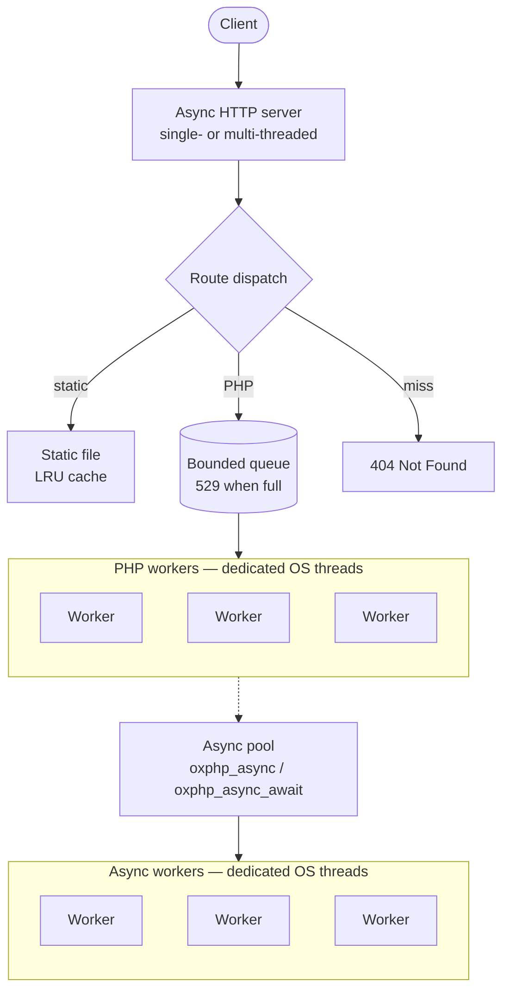
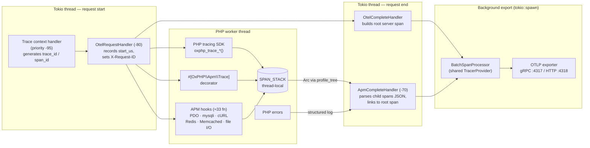

<p align="center">
  
</p>

<h3 align="center">Multithreaded PHP application server built for cloud-native infrastructure.</h3>

<p align="center">
  OxPHP is an asynchronous PHP application server written in Rust —<br>
  built for production workloads that demand low latency, high concurrency, and zero-config observability.
</p>

<p align="center">
  Documentation:
  <a href="https://oxphp.dev/en/docs/">English</a> ·
  <a href="https://oxphp.dev/ru/docs/">Русский</a> ·
  <a href="https://oxphp.dev/zh/docs/">中文</a> ·
  <a href="https://oxphp.dev/fr/docs/">Français</a> ·
  <a href="https://oxphp.dev/pl/docs/">Polski</a> ·
  <a href="https://oxphp.dev/ja/docs/">日本語</a>
</p>

<p align="center">
  <a href="#quick-start">Quick Start</a> · <a href="#why-oxphp">Why OxPHP</a> · <a href="#features">Features</a> · <a href="#configuration">Configuration</a> · <a href="#roadmap">Roadmap</a>
</p>

<p align="center">
  
  
  
  
  
  
  
  
</p>

---

> [!WARNING]
> **OxPHP is not production-ready yet.** The project is under active development — APIs may change, edge cases are still being uncovered, and there is no SLA. It **is** ready for evaluation, staging environments, and early adopters who want to test it on real workloads and report what breaks. Feedback, bug reports, and benchmarks against your stack are exactly what we need right now — open an issue or start a discussion on GitHub.

## Quick Start

Two lines. That's it.

```dockerfile
FROM ghcr.io/oxphp/oxphp:0.11.0

COPY --chown=www-data:www-data . /var/www/html/public
```

> **Note:** By default, `DOCUMENT_ROOT` is `/var/www/html/public` — the snippet above copies your app directly into the document root. For Laravel, Symfony, Slim, or any project that already ships a `public/` subdirectory, use `COPY --chown=www-data:www-data . /var/www/html` instead: the framework's own `public/` lines up with the default `DOCUMENT_ROOT`.

```bash
docker build -t my-app . && docker run -p 80:80 my-app
curl http://localhost/
```

No nginx config. No PHP-FPM pool tuning. No process manager. Just your app.

See the full [Quick Start guide](docs/getting-started/quick-start.md) for more details.

---

## Why OxPHP?

OxPHP replaces nginx + PHP-FPM with a single container. The server works out of the box — TLS, compression, rate limiting, Prometheus metrics, health checks, and structured JSON logs are configured via environment variables.

| | nginx + PHP-FPM | FrankenPHP | RoadRunner | **OxPHP** |
|---|---|---|---|---|
| Language | C | Go + C | Go | **Rust + C** |
| HTTP/3 | ✅ | ✅ | ✅ experimental | 🔜 roadmap |
| TLS 1.3 | ✅ | ✅ | ✅ | ✅ (rustls) |
| Persistent worker state | ❌ | ✅ | ✅ | ✅ |
| Backpressure / HTTP 529 | manual | ❌ | ❌ | ✅ built-in |
| Prometheus metrics | plugin | built-in (Caddy admin) | built-in plugin | ✅ built-in |
| Structured JSON logs | via `log_format` | ✅ | ✅ | ✅ built-in |
| Per-IP rate limiting | built-in | community module | ❌ | ✅ built-in |
| Custom error pages | ✅ (nginx config) | ✅ (Caddyfile) | ❌ | ✅ preloaded at startup |
| HTTP 103 Early Hints | ✅ (v1.29+) | ✅ | ✅ | 🔜 roadmap |
| Memory safety | ❌ (C) | partial (Go + cgo) | ✅ (Go, PHP isolated via IPC) | partial (Rust + C FFI) |
| WebSocket server | ✅ (proxies) | ✅ (Mercure) | ✅ (centrifuge plugin) | ❌ |
| Reverse proxy / upstream | ✅ (full-featured) | ✅ (Caddy) | ✅ | ❌ |
| Native install (non-Docker) | apt/yum/brew/port | brew, static binary | brew, binary | ❌ |
| Platforms (runtime) | Linux/BSD/Win/Mac | Linux/Mac/Win | Linux/Mac/Win | Linux only (glibc/musl) |
| Supported PHP versions | 7.4–8.4 | 8.2–8.4 | 7.4–8.4 | 8.4 and 8.5 |
| License | BSD-2 / PHP License | Apache-2.0 | MIT | AGPL-3.0 |
| Age / production track record | 20+ years | 2+ years | 7+ years | <1 year |

See the full [documentation](docs/index.md) for details.

---

## Benchmarks

> Formal benchmarks are coming soon. We are working on a reproducible test suite covering req/s, latency (p50/p99), memory usage, and worker throughput under concurrent load.
 
---

## Features

### PHP Runtime
- **Native PHP execution** — PHP runs directly inside the server process, in a dedicated thread pool
- **Full superglobals** support: `$_SERVER`, `$_GET`, `$_POST`, `$_COOKIE`, `$_FILES`, `php://input` — see [Superglobals](docs/php/superglobals.md)
- **HTTP Object API** — `oxphp_http_request()` returns a typed, lazy-loading request object with built-in JSON body parsing, content-detected MIME types for uploads, and a mutable attributes container for middleware — see [HTTP Request API](docs/php/request-api.md)
- **Worker Runtime API** — `OxPHP\Server\Worker::current()` exposes per-thread introspection (`id`, `requestCount`, `startTime`, `memoryUsage`, `rss`, `maxMemoryBytes`) and the worker entry point (`serve`) — see [Worker class](docs/php/worker-class.md)
- **Shared OPcache** across all workers — one worker compiles a file, every worker uses the cached bytecode — see [OPcache and JIT](docs/php/opcache.md)
- **PHP extension functions** — `oxphp_*()` helpers for streaming, early response, async, tracing, and request access — see [PHP functions reference](docs/php/functions.md)
- **Plugin system** with typed event dispatch, priority ordering, and PHP function registration
- **Attribute-based decorators** — intercept function/method calls via PHP 8+ attributes with zero overhead on undecorated code; supports `TARGET_FUNCTION`, `TARGET_METHOD`, `TARGET_CLASS` — see [Decorators](docs/features/decorators.md)
- **Crash isolation** — a fatal error in one request does not take down the server

### Worker Model
- **Worker mode** — persistent PHP processes that stay alive across requests; autoloaders, service containers, and DB connections are initialized once and reused — see [Worker mode](docs/features/worker-mode.md)
- **Fiber multiplexing** — each worker handles multiple concurrent requests via PHP 8.4 Fibers; `oxphp_sleep()` and `oxphp_async_await()` yield the current fiber instead of blocking the worker thread — see [Fiber multiplexing](docs/features/fiber-multiplexing.md)
- **Automatic recycling** by request count or memory threshold
- **Worker health monitoring** — crashed workers are automatically detected and restarted
- **Early response** via `oxphp_finish_request()` — send the response and keep running background work — see [Early response](docs/features/early-response.md)

### Async Promises
See the full [Async promises guide](docs/features/async-promises.md).

- **`oxphp_async()` / `oxphp_async_await()`** — dispatch closures to a dedicated thread pool for true parallel execution
- **Portable serialization** for `use` variables, arguments, and return values — safe cross-thread binary transfer
- Supported types: scalars, strings, arrays (nested). Resources and objects rejected with `E_WARNING`
- **Exception & die() safety** — exceptions, `die()`, and `exit()` are caught and re-thrown as `OxPHP\Async\AsyncException`
- **Timeout support** — per-task timeouts with `OxPHP\Async\TimeoutException`
- **`oxphp_async_await_all()` / `oxphp_async_await_race()` / `oxphp_async_await_any()`** — batch, race (first settled), and any (first fulfilled, JS `Promise.any` style) primitives

### Shared State (`OxPHP\Shared\*`)
Process-wide concurrent primitives that let PHP workers coordinate mutable state without Redis, Memcached, or APCu. Everything lives in-process — per-op cost is microseconds, not network round-trips. See the full [Shared state guide](docs/shared-state/shared-state.md) and [observability reference](docs/shared-state/shared-observability.md).

- **`Shared\Counter`** — atomic int64 accumulator (`get`, `set`, `add`, `compareAndSet`) — see [Counter](docs/shared-state/shared-counter.md)
- **`Shared\Atomic`** — full lock-free int64 primitive (`load`, `store`, `swap`, `compareAndSet`, `fetchAdd/Sub/And/Or/Xor`) with explicit memory ordering — see [Atomic](docs/shared-state/shared-atomic.md)
- **`Shared\Flag`** — atomic bool with `compareAndSet` for one-shot transitions — see [Flag](docs/shared-state/shared-flag.md)
- **`Shared\Once`** — run-once container with reentrancy-safe factory — see [Once](docs/shared-state/shared-once.md)
- **`Shared\Mutex`** — poisoning mutex over a stored value, with reentrancy and cross-thread deadlock detection — see [Mutex](docs/shared-state/shared-mutex.md)
- **`Shared\Channel`** — bounded MPMC queue, fiber-aware (blocking recv yields the current fiber) — see [Channel](docs/shared-state/shared-channel.md)
- **`Shared\Map`** — concurrent string-keyed store with batched `setMany`/`getMany` and cycle-checked nested values — see [Map](docs/shared-state/shared-map.md)
- **`Shared\Pool`** — bounded object pool with strict per-thread affinity, idle-timeout eviction, and chaos-reclaim on worker death — see [Pool](docs/shared-state/shared-pool.md)
- **`Shared\Registry`** — name-keyed handles (`Registry::counter('hits', fn() => ...)`) so every worker and every request converges on the same entry without external stores — see [Registry](docs/shared-state/shared-registry.md)
- **Built-in observability** — `oxphp_shared_*` Prometheus counters and `/__ox_shared/{summary,entries,entry,preview,types,graph}` JSON endpoints on the internal port
- **Refcount + lifecycle safety** — handles cannot outlive the registry entry; cycle detector rejects graphs that would leak memory
- When you outgrow it, see [Migrating to an external store](docs/shared-state/migrating-to-external-store.md)

### HTTP & Networking
- **HTTP/1.1 + HTTP/2 on one port** — the protocol is auto-detected per connection: prior-knowledge h2c over cleartext, or `h2` via ALPN under TLS, with transparent HTTP/1.1 fallback. Flow-control windows are tuned for typical PHP response sizes — see [HTTP/2](docs/features/tls.md#http2)
- **TLS 1.3** with ALPN — both HTTP/2 and HTTP/1.1 over TLS — see [TLS](docs/features/tls.md)
- **3 routing modes** — Traditional (file mapping + always-on PATH_INFO), Framework (`index.php` rewrite with `PATH_INFO=$request_uri`), SPA (`index.html` for no-extension paths, hard 404 for missing assets). Each mode mirrors a familiar nginx `try_files` configuration — see [Routing](docs/features/routing.md)
- **SSE streaming** via `Content-Type: text/event-stream` auto-detection or `oxphp_stream_flush()` — cooperative with fiber multiplexing — see [Server-Sent Events](docs/features/sse.md)
- **Configurable timeouts** — header read, request, and keep-alive — see [Timeouts](docs/features/timeouts.md)

### Performance
- **LRU file cache** for static files (in-memory ≤1 MB, streaming for larger) — see [Static files](docs/features/static-files.md)
- **HTTP caching** with ETag, Last-Modified, and 304 Not Modified
- **Compression** for text responses (256 B – 3 MB range) — Brotli, Zstandard and gzip, negotiated per client — see [Compression](docs/features/compression.md)
- **mimalloc** allocator for lower allocation latency under contention
- **Configurable HTTP server threads** — multi-threaded by default (CPU/2), tunable via `TOKIO_WORKERS`

### Observability
Full guide: [Distributed tracing](docs/features/distributed-tracing.md).

- **W3C Trace Context** — automatic `traceparent`/`tracestate` propagation, `$_SERVER['OXPHP_TRACE_ID']` for PHP log correlation
- **OpenTelemetry** — OTLP span export (gRPC/HTTP) with semantic conventions, configurable sampling, batch processing
- **APM auto-instrumentation** — internal PHP functions across PDO, mysqli, cURL, Redis, Memcached, and file I/O hooked at the engine level; every call becomes a span with zero code changes
- **`#[OxPHP\Apm\Trace]` decorator** — annotate any function or method with a PHP 8 attribute to create spans automatically
- **PHP tracing SDK** — 10 `oxphp_apm_*()` functions (`start`, `end`, `attribute`, `event`, `error`, `status`, `header`, `trace`, `trace_id`, `span_id`) for manual span creation, attributes, events, error recording, and trace context propagation
- **Prometheus metrics** at `/metrics` — per-worker, zero dependencies — see [Metrics](docs/operations/metrics.md)
- **Health check** at `/health` — ready for K8s readiness probes — see [Health checks](docs/operations/health-checks.md)
- **Internal server** on a separate port for health, metrics, and runtime config — see [Internal server](docs/features/internal-server.md)
- **Structured error logging** — PHP errors appear in the server log with `php_error_type`, `php_file`, `php_line` fields
- **JSON access logging** with optional `trace_id`/`span_id` fields (levels: `all`, `error`, off via `ACCESS_LOG`) — see [Access logging](docs/features/access-logging.md)
- **Request ID** generation + pass-through (`X-Request-ID`); trace-derived when OTel enabled — see [Request IDs](docs/features/request-ids.md)

### Profiling (`plugin-profiler` feature)

Full guide: [Profiling](docs/features/profiling.md).

- **Per-request profile capture** — triggered by cookie (`OXPROF`), header (`X-OxPHP-Profile`), query (`?__oxprof=`), or statistical sampling (`PROFILER_SAMPLE_RATE`); constant-time token compare
- **Four export formats** — xhprof (for xhgui), speedscope (for speedscope.app), pprof (Go tools / Pyroscope), collapsed (FlameGraph)
- **Rich per-span data** — wall-time, CPU time, memory (start/end), events, attributes — nanosecond precision throughout
- **PHP SDK** — 7 functions (`OxPHP\Profile\{start, stop, pause, resume, mark, metric, is_active}`) + 7 attributes (4 observer-filter: `#[Profile]` / `#[Exclude]` / `#[Sample]` / `#[Tag]`; 3 decorators: `#[Mark]` / `#[SlowThreshold]` / `#[MemoryThreshold]`)
- **Shared tree with APM** — both plugins read one `Arc<SpanTree>`; no double collection; APM continues to export only explicit spans to OTel while the profiler keeps the full tree
- **In-memory LRU + disk retention** — last `PROFILER_RETENTION_COUNT` runs always retrievable, token-bucket rate-limited writes, 5 s atomic-rename background trimmer
- **HTTP push** — ship profiles to xhgui or any collector; 3× exponential backoff (100/200/400 ms) with 5 s wallclock cap; xhgui envelope auto-detect
- **Internal HTTP routes** at `/__profiler/` — 8 endpoints (list / metadata / raw / speedscope redirect / DELETE / config / stats / landing) with optional bearer-token auth and path-traversal validation
- **Prometheus metrics** — 6 counters + 1 gauge (runs, spans, bytes, disk drops, push failures, truncated, in-memory runs) via `/metrics`

### Reliability & Operations
- **Bounded request queue** with 529 backpressure when full
- **Per-IP rate limiting** with `X-RateLimit-*` headers and 429 responses — see [Rate limiting](docs/features/rate-limiting.md)
- **Custom error pages** — pre-loaded at startup, zero I/O on the hot path — see [Error pages](docs/features/error-pages.md)
- **Graceful shutdown** — in-flight requests drain within `DRAIN_TIMEOUT_SECONDS` on SIGTERM/SIGINT — see [Graceful shutdown](docs/operations/graceful-shutdown.md)
- **Path traversal protection** — symlink escape detection — see [Symlink allow paths](docs/security/symlink-allow-paths.md)
- **Trusted proxy support** — real client IP extraction from `Forwarded` (RFC 7239) and `X-Forwarded-*` headers with CIDR-based trust — see [Trusted proxies](docs/security/trusted-proxies.md)
- **Dot-path blocking** — returns 404 for hidden files (`.env`, `.git/`) with `.well-known` exception (RFC 8615) — see [Dot-path blocking](docs/security/dot-path-blocking.md)
- **Non-root container** execution as www-data (UID 82)

---

## Architecture



- **Async HTTP server** — multi-threaded by default, tunable via `TOKIO_WORKERS`
- **PHP worker pool** — each worker is a dedicated OS thread; a crash in one worker does not affect the others
- Requests wait in a bounded queue between the HTTP server and the PHP workers; the queue returns 529 when full
- **Async pool** — separate threads for `oxphp_async()` tasks, preventing slowdowns in the main worker pool
- **Worker mode** — persistent PHP processes that stay alive between requests; autoloaders and DB connections are shared across all requests handled by that worker

### Internal Server

When `INTERNAL_ADDR` is set, a lightweight HTTP server starts on a separate port:

| Endpoint | Description |
|----------|-------------|
| `GET /health` | JSON health status (uptime, requests, connections) |
| `GET /metrics` | Prometheus text format metrics |
| `GET /config` | JSON runtime configuration (TLS paths redacted; `internal_addr` and `error_pages_dir` omitted) |

A port-only `INTERNAL_ADDR` (e.g. `:9090`) binds loopback; bind `0.0.0.0:9090` only to expose it. When the listener is reachable off-host without `INTERNAL_ALLOW_IPS`, the server warns at startup. Access control is by network isolation plus the `INTERNAL_ALLOW_IPS` CIDR allow-list — there is no bearer token by design, since a token invites exposing the port "because it's protected." Health probes are always reachable so orchestrator liveness/readiness checks never break.

### Tracing pipeline (`plugin-otel` + `plugin-apm`)

APM depends on OTel and shares its `TracerProvider` via the plugin service registry. Span collection happens on the PHP worker thread; OTLP export runs off the hot path via `tokio::spawn`.



- **Trace context** is generated first (priority `-95`) when `TRACE_CONTEXT=true` (auto-enabled by OTel). OTel's request handler at `-80` records `start_us`; APM's handler runs at `-70`.
- **Span collection is thread-local** — each PHP worker has its own `SPAN_STACK`. APM hooks, the `#[Trace]` decorator, and the `oxphp_trace_*()` SDK all push onto the same stack; child spans serialize to JSON at request end.
- **Shared `TracerProvider`** — OTel registers `otel.provider` as a plugin service; APM fetches the same `Arc<OnceLock<TracerProvider>>` so both plugins export to the same batch processor.
- **Off-hot-path export** — both complete handlers `tokio::spawn` OTLP export; the HTTP response is returned to the client before spans are sent.
- **Provider lifecycle** — OTel initializes the `BatchSpanProcessor` in `on_ready()` (after the Tokio runtime starts). On shutdown, `force_flush()` + `shutdown()` drain pending spans.

---

## Configuration

All settings are via environment variables — no config files required.

The essentials — what most deployments need to get a service up:

| Variable | Default | Description |
|---|---|---|
| `LISTEN_ADDR` | `0.0.0.0:80` | Address and port to bind |
| `DOCUMENT_ROOT` | `/var/www/html/public` | Filesystem path to serve files from |
| `ENTRY_FILE` | *(unset)* | Single canonical entry script. Unset = Traditional, `*.php` = Framework, non-`.php` = SPA. Resolved against `DOCUMENT_ROOT` |
| `WORKER_MODE_ENABLED` | `false` | Enable persistent worker mode. Requires `ENTRY_FILE` to point at a `.php` script |
| `INTERNAL_ADDR` | *(unset)* | Internal server for health/metrics/config. A port-only value like `:9090` binds `127.0.0.1`; use `0.0.0.0:9090` to expose it off-host |
| `INTERNAL_ALLOW_IPS` | *(unset)* | Comma-separated CIDRs allowed to reach `/metrics`, `/config` and other internal paths. Health endpoints (`/health`, `/healthz`, `/readyz`, `/startupz`, …) are always allowed. Empty = allow all. Loopback is not implicit — list `127.0.0.1/32` to keep localhost access |
| `TLS_CERT` | *(unset)* | Path to TLS certificate PEM file |
| `TLS_KEY` | *(unset)* | Path to TLS private key PEM file |
| `SUPERGLOBALS_ENABLED` | `true` | Populate `$_GET`, `$_POST`, `$_COOKIE`, `$_FILES`, `$_SERVER`; set `false` to rely solely on `oxphp_http_request()` |
| `ASYNC_WORKERS` | `0` (disabled) | Dedicated async worker threads for `oxphp_async()` |

Worker pool, queue, rate limiting, timeouts, TLS tuning, static file caching, compression, access logs, trusted proxies, PHP-execution deny rules, and every plugin-scoped variable live in the consolidated reference — see [Configuration](docs/operations/configuration.md) for the full table.

> **Boolean values** (case-insensitive, trimmed): truthy = `on` / `true` / `1` / `yes`; falsy = `off` / `false` / `0` / `no`. Any non-empty value outside that set — typos like `ture` — fails fast at startup with an error naming the variable. An unset variable or empty assignment (`FOO=`) falls back to the default, so Docker Compose / Kubernetes substitutions like `FOO=${FOO}` work cleanly when the host variable is missing.

### OpenTelemetry, APM, and Shared State

Plugin-scoped env vars (the `OTEL_*`, `OTEL_APM_*`, and `SHARED_*` families) live in the consolidated configuration reference so there is one source of truth:

- **OpenTelemetry** (`plugin-otel`): [Configuration → OpenTelemetry](docs/operations/configuration.md#opentelemetry). For the export pipeline end-to-end, see the [Distributed tracing guide](docs/features/distributed-tracing.md).
- **APM** (`plugin-apm`): [Configuration → APM](docs/operations/configuration.md#apm). Requires `OTEL_ENABLED=true`.
- **Shared State** (`plugin-shared`): [Configuration → Shared State](docs/operations/configuration.md#shared-state). Concept-level walkthrough lives in the [Shared state guide](docs/shared-state/shared-state.md).

---

## Build

```bash
# Host (without PHP — all tests pass, no PHP execution)
cargo build --release

# Docker (with PHP — full functionality)
docker compose build
```

### Run locally (static files only)

```bash
DOCUMENT_ROOT=./www/public ./target/release/oxphp
```

## Roadmap

> Items are not ordered by priority. Presence on this list does not guarantee implementation.

| Feature | Description |
|---|---|
| ~~**Trace Context (W3C)**~~ | ✅ Implemented — automatic propagation of `traceparent` / `tracestate` headers (W3C spec), enabled via `TRACE_CONTEXT=true` |
| ~~**OpenTelemetry**~~  | ✅ Implemented — OTLP trace export via `plugin-otel` feature, W3C context propagation, per-request spans with standard semantic conventions |
| ~~**APM & Auto-Instrumentation**~~ | ✅ Implemented — `plugin-apm` feature: automatic tracing of internal PHP functions across PDO, mysqli, cURL, Redis, Memcached, and file I/O, `#[OxPHP\Apm\Trace]` decorator, 10 `oxphp_apm_*()` SDK functions, PHP error capture |
| **Custom Metrics** | PHP API for registering application-defined Prometheus metrics from userland code |
| ~~**Built-in PHP Profiler**~~ | ✅ Implemented — `plugin-profiler` feature: per-request profiling with xhprof/speedscope/pprof/collapsed formats, PHP SDK, attribute triggers, in-memory LRU + disk retention, HTTP push to xhgui, `/__profiler/` internal routes, Prometheus metrics — see [Profiling](docs/features/profiling.md) |
| **Dockerfile.bookworm** | Official Debian Bookworm-based image as an alternative to Alpine |
| **Non-Docker Install** | *(speculative)* Native installation via system package managers (apt, brew, etc.) |
| **HTTP/3** | QUIC-based HTTP/3 support |
| **HTTP 103 Early Hints** | Send `103 Early Hints` responses to allow clients to preload resources before the final response |
| **Ecosystem Plugins** | Expanded plugin system: more lifecycle hooks, richer PHP API, and documentation for third-party plugin authors |
| ~~**Shared Async Runtime**~~ | ✅ Implemented — the same async runtime powers both the HTTP server and `oxphp_async()` / `oxphp_async_await()` with timeouts, result delivery, and race coordination |
| ~~**Promise API**~~ | ✅ Implemented — `oxphp_async()` / `oxphp_async_await()` with dedicated thread pool, portable serialization, and exception safety |
| ~~**Fiber Multiplexing**~~ | ✅ Implemented — each worker handles multiple concurrent requests via PHP 8.4 Fibers; `oxphp_sleep()` / `oxphp_usleep()` and `oxphp_async_await()` yield the fiber cooperatively |
| **Diagnostics** | Production doctor: checks OS limits (ulimit, TCP backlog, epoll/kqueue, container settings), identifies performance bottlenecks (worker queue depth, lock contention, GC/alloc pressure, ZTS stats), and gives specific actionable recommendations |
| **TLS hot-reload** | Reload TLS certificate and key without restart — compatible with cert-manager / SPIRE / istiod short-lived rotation, removes the rolling-restart-per-rotation workaround |
| **SPIFFE Workload API** | Native client for SPIFFE/SPIRE workload identity: streaming SVIDs over Unix socket with cryptographic node attestation, as an opt-in alternative to file-mount cert distribution |
| **FIPS-validated TLS** | Cargo-feature switch from `rustls` + `ring` to `rustls` + `aws-lc-rs` with the `fips` feature for FIPS 140-2 / 140-3 compliance in regulated deployments |

## Documentation

[oxphp.dev](https://oxphp.dev/) — [English](https://oxphp.dev/en/docs/) · [Русский](https://oxphp.dev/ru/docs/) · [中文](https://oxphp.dev/zh/docs/) · [Français](https://oxphp.dev/fr/docs/) · [Polski](https://oxphp.dev/pl/docs/) · [日本語](https://oxphp.dev/ja/docs/)

The English source of the documentation also lives in this repository under [`docs/`](docs/).

## License

[AGPL-3.0](LICENSE)

---

<p align="center"><sub><i>Built and evolved with AI under careful human guidance.</i></sub></p>