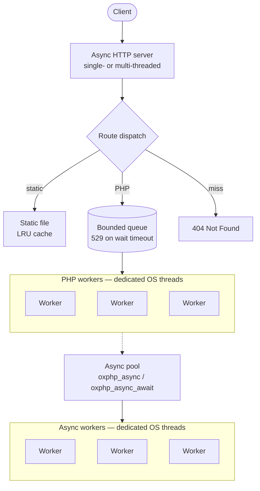
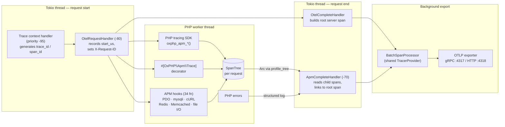

<p align="center">
  
</p>

<h3 align="center">Multithreaded PHP application server built for cloud-native infrastructure.</h3>

<p align="center">
  OxPHP is an asynchronous PHP application server written in Rust —<br>
  built for production workloads that demand low latency, high concurrency, and zero-config observability.
</p>

<p align="center">
  Documentation:
  <a href="https://oxphp.dev/en/docs/">English</a> ·
  <a href="https://oxphp.dev/ru/docs/">Русский</a> ·
  <a href="https://oxphp.dev/zh/docs/">中文</a> ·
  <a href="https://oxphp.dev/fr/docs/">Français</a> ·
  <a href="https://oxphp.dev/pl/docs/">Polski</a> ·
  <a href="https://oxphp.dev/ja/docs/">日本語</a>
</p>

<p align="center">
  <a href="#quick-start">Quick Start</a> · <a href="#why-oxphp">Why OxPHP</a> · <a href="#migration">Migration</a> · <a href="#features">Features</a> · <a href="#configuration">Configuration</a> · <a href="#roadmap">Roadmap</a>
</p>

<p align="center">
  
  
  
  
  
  
  
  
</p>

---

> [!WARNING]
> **OxPHP is not production-ready yet.** The project is under active development — APIs may change, edge cases are still being uncovered, and there is no SLA. It **is** ready for evaluation, staging environments, and early adopters who want to test it on real workloads and report what breaks. Feedback, bug reports, and benchmarks against your stack are exactly what we need right now — open an issue or start a discussion on GitHub.

## Quick Start

Two lines. That's it.

```dockerfile
FROM ghcr.io/oxphp/oxphp:0.12.0

COPY --chown=www-data:www-data . /var/www/html/public
```

> **Note:** By default, `DOCUMENT_ROOT` is `/var/www/html/public` — the snippet above copies your app directly into the document root. For Laravel, Symfony, Slim, or any project that already ships a `public/` subdirectory, use `COPY --chown=www-data:www-data . /var/www/html` instead: the framework's own `public/` lines up with the default `DOCUMENT_ROOT`.

```bash
docker build -t my-app . && docker run -p 80:80 my-app
curl http://localhost/
```

No nginx config. No PHP-FPM pool tuning. No process manager. Just your app.

See the full [Quick Start guide](docs/getting-started/quick-start.md) for more details.

---

## Why OxPHP?

OxPHP replaces nginx + PHP-FPM with a single container. The server works out of the box — TLS, compression, rate limiting, Prometheus metrics, health checks, and structured JSON logs are configured via environment variables.

- **One process instead of a stack.** HTTP/1.1, HTTP/2, TLS, static files, compression and PHP execution live in one binary. There are no FastCGI sockets, pool files or process managers to keep in sync between containers.
- **Threads, not processes.** PHP workers are OS threads of a single process (PHP ZTS) and share one OPcache: one worker compiles a file, every worker runs the cached bytecode — see [OPcache and JIT](docs/php/opcache.md).
- **Persistent workers when you want them.** [Worker mode](docs/features/worker-mode.md) keeps the autoloader, service container and DB connections alive between requests, and [fiber multiplexing](docs/features/fiber-multiplexing.md) lets one worker carry many requests while each waits on I/O. It is opt-in: the default mode starts every request from a clean PHP state, as PHP-FPM does.
- **Concurrency primitives built in.** [Async promises](docs/features/async-promises.md) for parallel work, and [`Shared\*`](docs/shared-state/shared-state.md) in-process counters, maps, channels and mutexes that cover single-host coordination without Redis or APCu.
- **Defined behaviour under overload.** Requests wait in a bounded queue; one that waits longer than `QUEUE_WAIT_TIMEOUT_MS` is refused with `529` and `Retry-After` rather than queuing without limit.
- **Observability without sidecars.** Prometheus `/metrics`, liveness/readiness/startup probes, JSON access logs, W3C Trace Context, OpenTelemetry export, APM auto-instrumentation of PDO, mysqli, cURL and Redis, and a per-request profiler all ship in the binary.
- **Safe defaults.** Hidden files (`.env`, `.git/`) return 404, symlink escapes are blocked, a deny-list stops `.php` execution in upload directories, `X-Forwarded-*` is honoured only from trusted proxies, and the process drops from root to `www-data` before serving a request.
- **Familiar routing.** Three of the four [routing modes](docs/features/routing.md) mirror an nginx `try_files` setup for a front-controller framework, a classic multi-entry app and a SPA.
- **Rust where it matters.** The HTTP layer (Tokio, rustls) is Rust; PHP is the stock engine from the official `php:*-zts` images, so the extensions and OPcache are the ones you already know.

See the full [documentation](docs/index.md) for details.

---

## Migration

### From nginx + PHP-FPM

Most applications move without code changes. The default mode runs each request from a clean PHP state, the same lifecycle PHP-FPM gives you, so the work is translating configuration. The [example deployments](docs/examples/index.md) are complete recipes for Laravel, Symfony, WordPress, Drupal, Magento and others.

**1. Pick the routing mode that matches your `try_files`.**

| nginx | OxPHP |
|---|---|
| `try_files $uri /index.php?$query_string` — Laravel, Symfony, Yii | `ENTRY_FILE=index.php` (Framework) |
| `try_files $uri $uri/ /index.php` with several PHP entry points — WordPress, OpenCart | `ENTRY_FILE` unset (Traditional) |
| `try_files $uri /index.html` — single-page app | `ENTRY_FILE=index.html` (SPA) |

**2. Build the image.** Start from the two-line Dockerfile in [Quick Start](#quick-start). Extensions must be built for thread-safe PHP, in a `php:*-zts-alpine` stage with the same PHP minor as the OxPHP image — see [Installing PHP extensions](docs/getting-started/docker.md#installing-php-extensions-in-production). Check that every PECL extension you use supports ZTS.

**3. Translate the configuration.** The image loads no `php.ini`. Keep your PHP settings (`memory_limit`, `upload_max_filesize`, OPcache, …) in a file of your own anywhere in the project, for example `docker/php.ini`, and copy it into the image's PHP config directory — a path inside the container, not in your project:

```dockerfile
FROM ghcr.io/oxphp/oxphp:0.12.0

COPY docker/php.ini /usr/local/etc/php/conf.d/zz-app.ini
COPY --chown=www-data:www-data . /var/www/html/public
```

PHP reads every `.ini` file in that directory in alphabetical order and the last value wins, so the `zz-` prefix makes yours apply after the image's own files. Mounting the file as a volume works too — see [PHP configuration](docs/getting-started/docker.md#php-configuration). The rest maps onto environment variables:

| nginx / PHP-FPM | OxPHP |
|---|---|
| `listen 443 ssl`, `ssl_certificate` | `TLS_CERT`, `TLS_KEY`, `TLS_MIN_VERSION` — [TLS](docs/features/tls.md) |
| `pm = static` / `pm = dynamic`, `pm.max_children` | `PHP_WORKERS=N` / `PHP_WORKERS=MIN:MAX` |
| `php_admin_value[...]`, `php.ini` | your own `.ini` file copied to `/usr/local/etc/php/conf.d/` in the image (see above) |
| `gzip on`, `brotli on` | on by default; `COMPRESSION_ENCODINGS` — [Compression](docs/features/compression.md) |
| `expires 30d` for static files | `STATIC_MAX_AGE` (default `30d`) |
| `limit_req` | `RATE_LIMIT`, `RATE_WINDOW_SECONDS` (fixed window per IP) — [Rate limiting](docs/features/rate-limiting.md) |
| `set_real_ip_from`, `real_ip_header` | `TRUSTED_PROXIES` — [Trusted proxies](docs/security/trusted-proxies.md) |
| `error_page 404 /404.html` | `ERROR_PAGES_DIR` with `{status}.html` — [Error pages](docs/features/error-pages.md) |
| `access_log` | `ACCESS_LOG=all` or `error`, JSON lines — [Access logging](docs/features/access-logging.md) |
| `location ~ ^/uploads/.*\.php$ { deny all; }` | `PHP_DENY_PATHS=/uploads/**` — [PHP deny-list](docs/security/php-deny.md) |
| `pm.status_path`, `ping.path` | `INTERNAL_ADDR` with `/health` and `/metrics` — [Health checks](docs/operations/health-checks.md) |
| `fastcgi_finish_request()` | `oxphp_finish_request()` — [Early response](docs/features/early-response.md) |

**4. Check the behaviour differences.**

- **`max_execution_time` counts wall-clock time.** Under PHP-FPM time spent waiting on a database or an HTTP call is not charged; under thread-safe PHP it is. A slow endpoint that never hit the limit before can start returning `504` — see [Timeouts](docs/features/timeouts.md#wall-clock-not-cpu-time).
- **`php_sapi_name()` returns `cli-server`.** Code that branches on `fpm-fcgi` needs another check: `function_exists('oxphp_request_id')`.
- **A few `$_SERVER` keys differ.** `SERVER_ADDR`, `PATH_TRANSLATED` and `REDIRECT_STATUS` are not set, and `PHP_AUTH_USER` / `PHP_AUTH_PW` are not extracted — read `HTTP_AUTHORIZATION` — see [Differences from PHP-FPM](docs/php/superglobals.md#differences-from-php-fpm).
- **Framing is restricted by default.** Responses carry `X-Frame-Options: SAMEORIGIN` and a matching `frame-ancestors` policy; set `FRAME_OPTIONS=off` if you manage framing elsewhere or embed the app in another origin.

**5. Roll out beside the old stack.** Run OxPHP next to nginx + PHP-FPM, point a share of traffic at it through your existing load balancer, use `/health/readiness` for probes, and compare error rates and latency on `/metrics` before moving the rest.

**6. Turn on worker mode last.** Migrate in the default mode first; then set `WORKER_MODE_ENABLED=true` and `ENTRY_FILE` to a worker script. State that lives in static properties and long-lived connections now survives between requests — read [What gets reset between requests](docs/features/worker-mode.md#what-gets-reset-between-requests) before enabling it.

### From FrankenPHP or RoadRunner

Worker scripts keep their shape: bootstrap once, then serve requests. Replace the `frankenphp_handle_request()` loop with a single `oxphp_worker($handler)` call — OxPHP runs the loop and calls the handler for each request — and read the request from the superglobals or `oxphp_http_request()`. RoadRunner's PSR-7 `waitRequest()` / `respond()` loop has no counterpart: move the application's handler into the same callback. See [`oxphp_worker()`](docs/php/functions.md#oxphp_worker) and [Worker mode](docs/features/worker-mode.md).

**Drop the `MAX_REQUESTS` counter.** There is no equivalent and you do not need one: a worker is not meant to be restarted every N requests, and doing so only hides a leak. If you suspect one, track it instead:

- chart `oxphp_worker_memory_bytes` per worker and watch for a steady climb;
- set `WORKER_MAX_MEMORY_MIB` as a safety net — a worker past the limit is replaced before the container runs out of memory, and each such recycle is counted in `oxphp_worker_recycles_by_reason_total{reason="max_memory"}`;
- remember that this limit measures only PHP's own heap. With extension-heavy stacks, compare `Worker::current()->rss()` against your own threshold and call `Worker::scheduleExit()`.

### What does not carry over

- **No reverse proxy or upstream.** There is no `proxy_pass` and no WebSocket server. If nginx also fronts other services, keep a proxy in front of OxPHP for those routes.
- **One port, one protocol.** An instance serves plain HTTP or HTTPS, not both, so the port-80 redirect to HTTPS needs a proxy or a second instance. The certificate is read at startup, so a renewal needs a restart — see [TLS](docs/features/tls.md).
- **Not yet available:** HTTP/3 and `103 Early Hints` — see the [Roadmap](#roadmap).
- **Platform.** Linux only, distributed as a Docker image; no apt or brew packages. PHP 8.4 and 8.5 are supported.

---

## Benchmarks

> Formal benchmarks are coming soon. We are working on a reproducible test suite covering req/s, latency (p50/p99), memory usage, and worker throughput under concurrent load.
 
---

## Features

### PHP Runtime
- **Native PHP execution** — PHP runs directly inside the server process, in a dedicated thread pool
- **Full superglobals** support: `$_SERVER`, `$_GET`, `$_POST`, `$_COOKIE`, `$_FILES`, `php://input` — see [Superglobals](docs/php/superglobals.md)
- **HTTP Object API** — `oxphp_http_request()` returns a typed, lazy-loading request object with built-in JSON body parsing, content-detected MIME types for uploads, and a mutable attributes container for middleware — see [HTTP Request API](docs/php/request-api.md)
- **Worker Runtime API** — `OxPHP\Server\Worker::current()` exposes per-thread introspection (`id`, `requestCount`, `startTime`, `memoryUsage`, `rss`, `maxMemoryBytes`) and the worker entry point (`serve`) — see [Worker class](docs/php/worker-class.md)
- **Shared OPcache** across all workers — one worker compiles a file, every worker uses the cached bytecode — see [OPcache and JIT](docs/php/opcache.md)
- **PHP extension functions** — `oxphp_*()` helpers for streaming, early response, async, tracing, and request access — see [PHP functions reference](docs/php/functions.md)
- **Plugin system** with typed event dispatch, priority ordering, and PHP function registration
- **Attribute-based decorators** — intercept function/method calls via PHP 8+ attributes with zero overhead on undecorated code; supports `TARGET_FUNCTION`, `TARGET_METHOD`, `TARGET_CLASS` — see [Decorators](docs/features/decorators.md)
- **Crash isolation** — a fatal error in one request does not take down the server

### Worker Model
- **Worker mode** — persistent PHP workers that stay alive across requests; autoloaders, service containers, and DB connections are initialized once and reused — see [Worker mode](docs/features/worker-mode.md)
- **Fiber multiplexing** — each worker handles multiple concurrent requests via PHP Fibers; `oxphp_sleep()` and `oxphp_async_await()` yield the current fiber instead of blocking the worker thread — see [Fiber multiplexing](docs/features/fiber-multiplexing.md)
- **Runtime hooks** — `RUNTIME_HOOKS=sleep,streams,net` makes native `sleep()`/`usleep()`, blocking TCP reads, `stream_select()`, connects, TLS waits and reads on local sockets suspend the fiber instead of the worker thread, so unmodified PDO MySQL, mysqli and phpredis code benefits — see [Runtime hooks](docs/operations/configuration.md#runtime-hooks)
- **Automatic recycling** — in worker mode a worker is recycled when it passes `WORKER_MAX_MEMORY_MIB`, when the application calls `Worker::scheduleExit()`, or after three consecutive requests come apart, a fatal error being the usual one — see [Recycling](docs/features/worker-mode.md#recycling)
- **Worker health monitoring** — crashed workers are automatically detected and replaced; a static pool refills to its configured count, a dynamic one to its minimum
- **Early response** via `oxphp_finish_request()` — send the response and keep running background work — see [Early response](docs/features/early-response.md)

### Async Promises
See the full [Async promises guide](docs/features/async-promises.md).

- **`oxphp_async()` / `oxphp_async_await()`** — dispatch closures to a dedicated thread pool for true parallel execution
- **Portable serialization** for `use` variables, arguments, and return values — safe cross-thread binary transfer
- Supported types: scalars, strings, arrays (nested), and `Shared\*` / `OxPHP\Shared\Shareable` objects. Resources and plain objects are rejected — see [Limitations](docs/features/async-promises.md#limitations)
- **Exception & die() safety** — exceptions, `die()`, and `exit()` are caught and re-thrown as `OxPHP\Async\AsyncException`
- **Timeout support** — per-task timeouts with `OxPHP\Async\TimeoutException`
- **`oxphp_async_await_all()` / `oxphp_async_await_race()` / `oxphp_async_await_any()`** — batch, race (first settled), and any (first fulfilled, JS `Promise.any` style) primitives

### Shared State (`OxPHP\Shared\*`)
Process-wide concurrent primitives that let PHP workers coordinate mutable state without Redis, Memcached, or APCu. Everything lives in-process — per-op cost is microseconds, not network round-trips. See the full [Shared state guide](docs/shared-state/shared-state.md) and [observability reference](docs/shared-state/shared-observability.md).

- **`Shared\Counter`** — atomic int64 accumulator (`get`, `set`, `add`, `compareAndSet`) — see [Counter](docs/shared-state/shared-counter.md)
- **`Shared\Atomic`** — full lock-free int64 primitive (`load`, `store`, `swap`, `compareAndSet`, `fetchAdd/Sub/And/Or/Xor`) with explicit memory ordering — see [Atomic](docs/shared-state/shared-atomic.md)
- **`Shared\Flag`** — atomic bool with `compareAndSet` for one-shot transitions — see [Flag](docs/shared-state/shared-flag.md)
- **`Shared\Once`** — run-once container with reentrancy-safe factory — see [Once](docs/shared-state/shared-once.md)
- **`Shared\Mutex`** — poisoning mutex over a stored value, with reentrancy and cross-thread deadlock detection — see [Mutex](docs/shared-state/shared-mutex.md)
- **`Shared\Channel`** — bounded MPMC queue, fiber-aware (blocking recv yields the current fiber) — see [Channel](docs/shared-state/shared-channel.md)
- **`Shared\Map`** — concurrent `int|string`-keyed store with batched `setMany`/`getMany` and cycle-checked nested values — see [Map](docs/shared-state/shared-map.md)
- **`Shared\Pool`** — bounded object pool with strict per-thread affinity, idle-timeout eviction, and chaos-reclaim on worker death — see [Pool](docs/shared-state/shared-pool.md)
- **`Shared\Registry`** — name-keyed handles (`Registry::counter('hits', fn() => ...)`) so every worker and every request converges on the same entry without external stores — see [Registry](docs/shared-state/shared-registry.md)
- **Built-in observability** — `oxphp_shared_*` Prometheus counters and `/__ox_shared/{summary,entries,entry,preview,types,graph}` JSON endpoints on the internal port
- **Refcount + lifecycle safety** — handles cannot outlive the registry entry; cycle detector rejects graphs that would leak memory
- When you outgrow it, see [Migrating to an external store](docs/shared-state/migrating-to-external-store.md)

### HTTP & Networking
- **HTTP/1.1 + HTTP/2 on one port** — the protocol is auto-detected per connection: prior-knowledge h2c over cleartext, or `h2` via ALPN under TLS, with transparent HTTP/1.1 fallback. Flow-control windows are tuned for typical PHP response sizes — see [HTTP/2](docs/features/tls.md#http2)
- **TLS 1.3** with ALPN — both HTTP/2 and HTTP/1.1 over TLS — see [TLS](docs/features/tls.md)
- **4 routing modes** — Traditional (file mapping + always-on PATH_INFO), Framework (every request to `index.php`; the original path is in `REQUEST_URI`, `PATH_INFO` only for `/index.php/extra`), SPA (`index.html` for no-extension paths, hard 404 for missing assets), Worker (static assets from disk, everything else to the persistent worker entry). The first three mirror a familiar nginx `try_files` configuration — see [Routing](docs/features/routing.md)
- **SSE streaming** via `Content-Type: text/event-stream` auto-detection or `oxphp_stream_flush()` — cooperative with fiber multiplexing — see [Server-Sent Events](docs/features/sse.md)
- **Timeouts** — header read (`HEADER_TIMEOUT_SECONDS`, slowloris protection); script execution is bounded by PHP's own `max_execution_time` / `set_time_limit()`, answered with 504 — see [Timeouts](docs/features/timeouts.md)

### Performance
- **LRU file cache** for static files (in-memory ≤1 MiB, streaming for larger) — see [Static files](docs/features/static-files.md)
- **HTTP caching** with ETag, Last-Modified, and 304 Not Modified
- **Compression** for text responses (256 B – 3 MiB range) — Brotli, Zstandard and gzip, negotiated per client — see [Compression](docs/features/compression.md)
- **mimalloc** allocator for lower allocation latency under contention
- **Configurable HTTP server threads** — CPU/2 worker threads by default (single-threaded on hosts with fewer than 4 CPUs), tunable via `TOKIO_WORKERS`

### Observability
Full guide: [Distributed tracing](docs/features/distributed-tracing.md).

- **W3C Trace Context** — automatic `traceparent`/`tracestate` propagation, `$_SERVER['OXPHP_TRACE_ID']` for PHP log correlation
- **OpenTelemetry** — OTLP span export (gRPC/HTTP) with semantic conventions, configurable sampling, batch processing
- **APM auto-instrumentation** — internal PHP functions across PDO, mysqli, cURL, Redis, Memcached, and file I/O hooked at the engine level; every call becomes a span with zero code changes
- **`#[OxPHP\Apm\Trace]` decorator** — annotate any function or method with a PHP 8 attribute to create spans automatically
- **PHP tracing SDK** — 10 `oxphp_apm_*()` functions (`start`, `end`, `attribute`, `event`, `error`, `status`, `header`, `trace`, `trace_id`, `span_id`) for manual span creation, attributes, events, error recording, and trace context propagation
- **Prometheus metrics** at `/metrics` — per-worker, zero dependencies — see [Metrics](docs/operations/metrics.md)
- **Health checks** at `/health/liveness`, `/health/readiness` and `/health/startup`, with `/health` aggregating them for dashboards — see [Health checks](docs/operations/health-checks.md)
- **Internal server** on a separate port for health, metrics, and runtime config — see [Internal server](docs/features/internal-server.md)
- **Structured error logging** — PHP errors appear in the server log with `php_error_type`, `php_file`, `php_line` fields
- **JSON access logging** with optional `trace_id`/`span_id` fields (levels: `all`, `error`, off via `ACCESS_LOG`) — see [Access logging](docs/features/access-logging.md)
- **Request ID** generation + pass-through (`X-Request-ID`); trace-derived when OTel enabled — see [Request IDs](docs/features/request-ids.md)

### Profiling (`plugin-profiler` feature)

Full guide: [Profiling](docs/features/profiling.md).

- **Per-request profile capture** — triggered by cookie (`OXPROF`), header (`X-OxPHP-Profile`), query (`?__oxprof=`), or statistical sampling (`PROFILER_SAMPLE_RATE`); constant-time token compare
- **Four export formats** — xhprof (for xhgui), speedscope (for speedscope.app), pprof (Go tools / Pyroscope), collapsed (FlameGraph)
- **Rich per-span data** — wall-time, CPU time, memory (start/end), events, attributes — nanosecond precision throughout
- **PHP SDK** — 7 functions (`OxPHP\Profile\{start, stop, pause, resume, mark, metric, is_active}`) + 7 attributes (4 observer-filter: `#[Profile]` / `#[Exclude]` / `#[Sample]` / `#[Tag]`; 3 decorators: `#[Mark]` / `#[SlowThreshold]` / `#[MemoryThreshold]`)
- **Shared tree with APM** — both plugins read one `Arc<SpanTree>`; no double collection; APM continues to export only explicit spans to OTel while the profiler keeps the full tree
- **In-memory LRU + disk retention** — last `PROFILER_RETENTION_COUNT` runs always retrievable, token-bucket rate-limited writes, 5 s atomic-rename background trimmer
- **HTTP push** — ship profiles to xhgui or any collector; 3× exponential backoff (100/200/400 ms) with 5 s wallclock cap; xhgui envelope auto-detect
- **Internal HTTP routes** at `/__profiler/` — 8 endpoints (list / metadata / raw / speedscope redirect / DELETE / config / stats / landing) with optional bearer-token auth and path-traversal validation
- **Prometheus metrics** — 8 counters + 1 gauge (runs, spans, bytes, disk drops, disk/HTTP saturation drops, push failures, truncated, in-memory runs) via `/metrics`

### Reliability & Operations
- **Admission control** — a request waits up to `QUEUE_WAIT_TIMEOUT_MS` for a PHP worker and is refused with `529` + `Retry-After` past it; the waiting set itself is bounded — see [Configuration](docs/operations/configuration.md)
- **Per-IP rate limiting** with `X-RateLimit-*` headers and 429 responses — see [Rate limiting](docs/features/rate-limiting.md)
- **Custom error pages** — pre-loaded at startup, zero I/O on the hot path — see [Error pages](docs/features/error-pages.md)
- **Graceful shutdown** — on SIGTERM/SIGINT in-flight requests get up to `DRAIN_TIMEOUT_SECONDS` to finish, then are cancelled — see [Graceful shutdown](docs/operations/graceful-shutdown.md)
- **Path traversal protection** — symlink escape detection — see [Symlink allow paths](docs/security/symlink-allow-paths.md)
- **Trusted proxy support** — real client IP extraction from `Forwarded` (RFC 7239) and `X-Forwarded-*` headers with CIDR-based trust — see [Trusted proxies](docs/security/trusted-proxies.md)
- **Dot-path blocking** — returns 404 for hidden files (`.env`, `.git/`) with `.well-known` exception (RFC 8615) — see [Dot-path blocking](docs/security/dot-path-blocking.md)
- **Privilege drop** — the container starts as root so it can bind port 80, and `oxphp` drops to `www-data` (UID 82) before handling any request; `--user` overrides the target

---

## Architecture


```mermaid
flowchart TD
    Client([Client])
    HTTP["Async HTTP server<br/>single- or multi-threaded"]
    Route{Route dispatch}
    Static["Static file<br/>LRU cache"]
    Queue[("Bounded queue<br/>529 on wait timeout")]
    NF["404 Not Found"]
    Pool["Async pool<br/>oxphp_async / oxphp_async_await"]

    Client --> HTTP
    HTTP --> Route
    Route -->|static| Static
    Route -->|miss| NF
    Route -->|PHP| Queue
    Queue --> PhpWorkers
    PhpWorkers -.-> Pool
    Pool --> AsyncWorkers

    subgraph PhpWorkers [PHP workers — dedicated OS threads]
        direction BT
        W1[Worker]
        W2[Worker]
        W3[Worker]
    end

    subgraph AsyncWorkers [Async workers — dedicated OS threads]
        direction BT
        A1[Worker]
        A2[Worker]
        A3[Worker]
    end
```

- **Async HTTP server** — multi-threaded by default, tunable via `TOKIO_WORKERS`
- **PHP worker pool** — each worker is a dedicated OS thread; a crash in one worker does not affect the others
- Requests wait in a bounded queue between the HTTP server and the PHP workers; a request that waits longer than `QUEUE_WAIT_TIMEOUT_MS` for a worker is refused with 529
- **Async pool** — separate threads for `oxphp_async()` tasks, preventing slowdowns in the main worker pool
- **Worker mode** — persistent PHP workers that stay alive between requests; autoloaders and DB connections are shared across all requests handled by that worker

### Internal Server

When `INTERNAL_ADDR` is set, a lightweight HTTP server starts on a separate port:

| Endpoint | Description |
|----------|-------------|
| `GET /health` | Aggregate JSON health status (uptime, requests, connections); `503` when a plugin fails, no worker thread is alive, or the pool is stalled |
| `GET /health/liveness`, `/health/readiness`, `/health/startup` | Orchestrator probes (aliases `/healthz`, `/readyz`, `/startupz`) — see [Health checks](docs/operations/health-checks.md) |
| `GET /metrics` | Prometheus text format metrics |
| `GET /config` | JSON runtime configuration (TLS paths redacted; `internal_addr` and `error_pages_dir` omitted) |

A port-only `INTERNAL_ADDR` (e.g. `:9090`) binds loopback; bind `0.0.0.0:9090` only to expose it. When the listener is reachable off-host without `INTERNAL_ALLOW_IPS`, the server warns at startup. Access control is by network isolation plus the `INTERNAL_ALLOW_IPS` CIDR allow-list — there is no bearer token by design, since a token invites exposing the port "because it's protected." Health probes are always reachable so orchestrator liveness/readiness checks never break.

### Tracing pipeline (`plugin-otel` + `plugin-apm`)

APM depends on OTel and shares its `TracerProvider` via the plugin service registry. Span collection happens on the PHP worker thread; OTLP export runs off the hot path.


```mermaid
flowchart LR
    subgraph Tokio1 ["Tokio thread — request start"]
        TC["Trace context handler<br/>(priority -95)<br/>generates trace_id / span_id"]
        OTR["OtelRequestHandler (-80)<br/>records start_us,<br/>sets X-Request-ID"]
    end

    subgraph PHP ["PHP worker thread"]
        SDK["PHP tracing SDK<br/>oxphp_apm_*()"]
        DEC["#[OxPHP\\Apm\\Trace]<br/>decorator"]
        HOOKS["APM hooks (34 fn)<br/>PDO · mysqli · cURL<br/>Redis · Memcached · file I/O"]
        STACK[("SpanTree<br/>per request")]
        PHPERR["PHP errors"]
    end

    subgraph Tokio2 ["Tokio thread — request end"]
        OTC["OtelCompleteHandler<br/>builds root server span"]
        APC["ApmCompleteHandler (-70)<br/>reads child spans,<br/>links to root span"]
    end

    subgraph Export ["Background export"]
        BATCH["BatchSpanProcessor<br/>(shared TracerProvider)"]
        OTLP["OTLP exporter<br/>gRPC :4317 / HTTP :4318"]
    end

    TC --> OTR
    OTR --> SDK
    OTR --> DEC
    OTR --> HOOKS
    SDK --> STACK
    DEC --> STACK
    HOOKS --> STACK
    STACK -->|Arc<SpanTree> via profile_tree| APC
    PHPERR -->|structured log| APC
    OTR --> OTC
    OTC --> BATCH
    APC --> BATCH
    BATCH --> OTLP
```

- **Trace context** is generated first (priority `-95`) when `TRACE_CONTEXT=true` (auto-enabled by OTel). OTel's request handler at `-80` records `start_us`; APM's handler runs at `-70`.
- **One span tree per request** — APM hooks, the `#[Trace]` decorator, and the `oxphp_apm_*()` SDK record into the same per-request span tree, handed to the complete handler as `Arc<SpanTree>`.
- **Shared `TracerProvider`** — OTel registers `otel.provider` as a plugin service; APM fetches the same `Arc<OnceLock<TracerProvider>>` so both plugins export to the same batch processor.
- **Off-hot-path export** — OTel enqueues the root span into the `BatchSpanProcessor`, which exports on its own thread, and APM exports child spans from a `tokio::spawn` task; the HTTP response is returned to the client before spans are sent.
- **Provider lifecycle** — OTel initializes the `BatchSpanProcessor` in `on_ready()` (after the Tokio runtime starts). On shutdown, `force_flush()` + `shutdown()` drain pending spans.

---

## Configuration

All settings are via environment variables — no config files required.

The essentials — what most deployments need to get a service up:

| Variable | Default | Description |
|---|---|---|
| `LISTEN_ADDR` | `0.0.0.0:80` | Address and port to bind |
| `DOCUMENT_ROOT` | `/var/www/html/public` | Filesystem path to serve files from |
| `ENTRY_FILE` | *(unset)* | Single canonical entry script. Unset = Traditional, `*.php` = Framework, non-`.php` = SPA. Resolved against `DOCUMENT_ROOT` |
| `WORKER_MODE_ENABLED` | `false` | Enable persistent worker mode. Requires `ENTRY_FILE` to point at a `.php` script |
| `INTERNAL_ADDR` | *(unset)* | Internal server for health/metrics/config. A port-only value like `:9090` binds `127.0.0.1`; use `0.0.0.0:9090` to expose it off-host |
| `INTERNAL_ALLOW_IPS` | *(unset)* | Comma-separated CIDRs allowed to reach `/metrics`, `/config` and other internal paths. Health endpoints (`/health`, `/healthz`, `/readyz`, `/startupz`, …) are always allowed. Empty = allow all. Loopback is not implicit — list `127.0.0.1/32` to keep localhost access |
| `TLS_CERT` | *(unset)* | Path to TLS certificate PEM file |
| `TLS_KEY` | *(unset)* | Path to TLS private key PEM file |
| `SUPERGLOBALS_ENABLED` | `true` | Build `$_SERVER` and `$_GET`; set `false` to skip that and read the request through `oxphp_http_request()`. `$_POST`, `$_FILES` and `$_COOKIE` are built either way |
| `ASYNC_WORKERS` | `0` (disabled) | Dedicated async worker threads for `oxphp_async()` |

Worker pool, queue, rate limiting, timeouts, TLS tuning, static file caching, compression, access logs, trusted proxies, PHP-execution deny rules, and every plugin-scoped variable live in the consolidated reference — see [Configuration](docs/operations/configuration.md) for the full table.

> **Boolean values** (case-insensitive, trimmed): truthy = `on` / `true` / `1` / `yes`; falsy = `off` / `false` / `0` / `no`. Any non-empty value outside that set — typos like `ture` — fails fast at startup with an error naming the variable. An unset variable or empty assignment (`FOO=`) falls back to the default, so Docker Compose / Kubernetes substitutions like `FOO=${FOO}` work cleanly when the host variable is missing.

### OpenTelemetry, APM, and Shared State

Plugin-scoped env vars (the `OTEL_*`, `OTEL_APM_*`, and `SHARED_*` families) live in the consolidated configuration reference so there is one source of truth:

- **OpenTelemetry** (`plugin-otel`): [Configuration → OpenTelemetry](docs/operations/configuration.md#opentelemetry). For the export pipeline end-to-end, see the [Distributed tracing guide](docs/features/distributed-tracing.md).
- **APM** (`plugin-apm`): [Configuration → APM](docs/operations/configuration.md#apm). Requires `OTEL_ENABLED=true`.
- **Shared State** (`plugin-shared`): [Configuration → Shared State](docs/operations/configuration.md#shared-state). Concept-level walkthrough lives in the [Shared state guide](docs/shared-state/shared-state.md).

---

## Build

```bash
# Host (without PHP — stub executor, no PHP execution)
cargo build --release --no-default-features

# Docker (with PHP — full functionality)
docker compose build
```

### Run locally (static files only)

```bash
LISTEN_ADDR=127.0.0.1:8080 DOCUMENT_ROOT=./www/public ./target/release/oxphp
```

## Roadmap

> Items are not ordered by priority. Presence on this list does not guarantee implementation.

| Feature | Description |
|---|---|
| ~~**Trace Context (W3C)**~~ | ✅ Implemented — automatic propagation of `traceparent` / `tracestate` headers (W3C spec), enabled via `TRACE_CONTEXT=true` |
| ~~**OpenTelemetry**~~  | ✅ Implemented — OTLP trace export via `plugin-otel` feature, W3C context propagation, per-request spans with standard semantic conventions |
| ~~**APM & Auto-Instrumentation**~~ | ✅ Implemented — `plugin-apm` feature: automatic tracing of internal PHP functions across PDO, mysqli, cURL, Redis, Memcached, and file I/O, `#[OxPHP\Apm\Trace]` decorator, 10 `oxphp_apm_*()` SDK functions, PHP error capture |
| **Custom Metrics** | PHP API for registering application-defined Prometheus metrics from userland code |
| ~~**Built-in PHP Profiler**~~ | ✅ Implemented — `plugin-profiler` feature: per-request profiling with xhprof/speedscope/pprof/collapsed formats, PHP SDK, attribute triggers, in-memory LRU + disk retention, HTTP push to xhgui, `/__profiler/` internal routes, Prometheus metrics — see [Profiling](docs/features/profiling.md) |
| **Dockerfile.bookworm** | Official Debian Bookworm-based image as an alternative to Alpine |
| **Non-Docker Install** | *(speculative)* Native installation via system package managers (apt, brew, etc.) |
| **HTTP/3** | QUIC-based HTTP/3 support |
| **HTTP 103 Early Hints** | Send `103 Early Hints` responses to allow clients to preload resources before the final response |
| **Ecosystem Plugins** | Expanded plugin system: more lifecycle hooks, richer PHP API, and documentation for third-party plugin authors |
| ~~**Shared Async Runtime**~~ | ✅ Implemented — the same async runtime powers both the HTTP server and `oxphp_async()` / `oxphp_async_await()` with timeouts, result delivery, and race coordination |
| ~~**Promise API**~~ | ✅ Implemented — `oxphp_async()` / `oxphp_async_await()` with dedicated thread pool, portable serialization, and exception safety |
| ~~**Fiber Multiplexing**~~ | ✅ Implemented — each worker handles multiple concurrent requests via PHP Fibers; `oxphp_sleep()` / `oxphp_usleep()` and `oxphp_async_await()` yield the fiber cooperatively |
| **Diagnostics** | Production doctor: checks OS limits (ulimit, TCP backlog, epoll/kqueue, container settings), identifies performance bottlenecks (worker queue depth, lock contention, GC/alloc pressure, ZTS stats), and gives specific actionable recommendations |
| **TLS hot-reload** | Reload TLS certificate and key without restart — compatible with cert-manager / SPIRE / istiod short-lived rotation, removes the rolling-restart-per-rotation workaround |
| **SPIFFE Workload API** | Native client for SPIFFE/SPIRE workload identity: streaming SVIDs over Unix socket with cryptographic node attestation, as an opt-in alternative to file-mount cert distribution |
| **FIPS-validated TLS** | Cargo-feature switch from `rustls` + `ring` to `rustls` + `aws-lc-rs` with the `fips` feature for FIPS 140-2 / 140-3 compliance in regulated deployments |

## Documentation

[oxphp.dev](https://oxphp.dev/) — [English](https://oxphp.dev/en/docs/) · [Русский](https://oxphp.dev/ru/docs/) · [中文](https://oxphp.dev/zh/docs/) · [Français](https://oxphp.dev/fr/docs/) · [Polski](https://oxphp.dev/pl/docs/) · [日本語](https://oxphp.dev/ja/docs/)

The English source of the documentation also lives in this repository under [`docs/`](docs/).

## License

[AGPL-3.0](LICENSE)

---

<p align="center"><sub><i>Built and evolved with AI under careful human guidance.</i></sub></p>