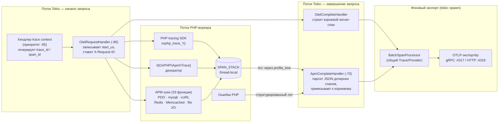

<p align="center">
  
</p>

<h3 align="center">Многопоточный сервер PHP-приложений, созданный для облачной инфраструктуры.</h3>

<p align="center">
  OxPHP — асинхронный сервер PHP-приложений, написанный на Rust.<br>
  Создан для продакшн-нагрузок, требующих низкой задержки, высокой конкурентности и наблюдаемости без дополнительной настройки.
</p>

<p align="center">
  <a href="README.md">English</a> · <b>Русский</b> · <a href="README.zh.md">中文</a>
</p>

<p align="center">
  Documents: <a href="docs/en/">English</a> · <a href="docs/ru/">Русский</a> · <a href="docs/zh/">中文</a>
</p>

<p align="center">
  <a href="#быстрый-старт">Быстрый старт</a> · <a href="#почему-oxphp">Почему OxPHP</a> · <a href="#возможности">Возможности</a> · <a href="#конфигурация">Конфигурация</a> · <a href="#дорожная-карта">Дорожная карта</a>
</p>

<p align="center">
  
  
  
  
  
  
  
  
</p>

---

## Быстрый старт

Две строчки. Это всё.

```dockerfile
FROM ghcr.io/oxphp/oxphp:0.2.0

COPY --chown=www-data:www-data . /var/www/html/public
```

> **Примечание:** По умолчанию `DOCUMENT_ROOT` равен `/var/www/html/public` — пример выше копирует приложение прямо в document root. Для Laravel, Symfony, Slim и любых проектов с собственным подкаталогом `public/` используйте `COPY --chown=www-data:www-data . /var/www/html`: `public/` фреймворка совпадёт с дефолтным `DOCUMENT_ROOT`.

```bash
docker build -t my-app . && docker run -p 80:80 my-app
curl http://localhost/
```

Без конфигурации nginx. Без настройки пулов PHP-FPM. Без менеджера процессов. Просто ваше приложение.

Подробнее — в полном [руководстве по быстрому старту](docs/ru/getting-started/quick-start.md).

---

## Почему OxPHP?

OxPHP заменяет связку nginx + PHP-FPM одним контейнером. Сервер работает из коробки — TLS, сжатие Brotli, rate limiting, метрики Prometheus, проверки состояния и структурированные JSON-логи настраиваются через переменные окружения.

| | nginx + PHP-FPM | FrankenPHP | RoadRunner | **OxPHP** |
|---|---|---|---|---|
| Язык | C | Go + C | Go | **Rust + C** |
| HTTP/2 | ✅ | ✅ | ✅ | ✅ |
| HTTP/3 | ✅ | ✅ | ✅ experimental | 🔜 в планах |
| TLS 1.3 | ✅ | ✅ | ✅ | ✅ (rustls) |
| Persistent worker state | ❌ | ✅ | ✅ | ✅ |
| Backpressure / HTTP 529 | вручную | ❌ | ❌ | ✅ встроено |
| Метрики Prometheus | плагин | встроено (Caddy admin) | встроенный плагин | ✅ встроено |
| Structured JSON логи | через `log_format` | ✅ | ✅ | ✅ встроено |
| Per-IP rate limiting | встроено | community-модуль | ❌ | ✅ встроено |
| Кастомные страницы ошибок | ✅ (nginx config) | ✅ (Caddyfile) | ❌ | ✅ preload при старте |
| HTTP 103 Early Hints | ✅ (v1.29+) | ✅ | ✅ | 🔜 в планах |
| Memory safety | ❌ (C) | частично (Go + cgo) | ✅ (Go, PHP изолирован через IPC) | частично (Rust + C FFI) |
| WebSocket сервер | ✅ (проксирует) | ✅ (Mercure) | ✅ (centrifuge плагин) | ❌ |
| Реверс-прокси / upstream | ✅ (полноценный) | ✅ (Caddy) | ✅ | ❌ |
| Native install (без Docker) | apt/yum/brew/port | brew, static binary | brew, бинарь | в планах |
| Платформы (runtime) | Linux/BSD/Win/Mac | Linux/Mac/Win | Linux/Mac/Win | только Linux (glibc/musl) |
| Поддерживаемые версии PHP | 7.4–8.4 | 8.2–8.4 | 7.4–8.4 | только 8.4 (8.5 падает с SIGBUS) |
| Лицензия | BSD-2 / PHP License | Apache-2.0 | MIT | AGPL-3.0 |
| Возраст / production track record | 20+ лет | 2+ года | 7+ лет | <1 года |

Подробнее о возможностях — в [документации](docs/ru/index.md).

---

## Бенчмарки

> Формальные бенчмарки скоро появятся. Мы работаем над воспроизводимым набором тестов, охватывающим req/s, задержки (p50/p99), использование памяти и пропускную способность воркеров под конкурентной нагрузкой.

---

## Возможности

### PHP-среда выполнения
- **Нативное выполнение PHP** — PHP работает непосредственно внутри серверного процесса, в выделенном пуле потоков
- **Полная поддержка суперглобальных переменных**: `$_SERVER`, `$_GET`, `$_POST`, `$_COOKIE`, `$_FILES`, `php://input` — см. [Суперглобальные переменные](docs/ru/php/superglobals.md)
- **HTTP Object API** — `oxphp_http_request()` возвращает типизированный объект запроса с ленивой загрузкой, встроенным парсингом JSON, определением MIME-типов загруженных файлов и мутабельным контейнером атрибутов для middleware — см. [HTTP Request API](docs/ru/php/request-api.md)
- **Общий OPcache** между всеми воркерами — один воркер компилирует файл, остальные используют кешированный байткод — см. [OPcache и JIT](docs/ru/php/opcache.md)
- **PHP-функции расширения** — хелперы `oxphp_*()` для стриминга, раннего ответа, async, трассировки и доступа к запросу — см. [Справочник PHP-функций](docs/ru/php/functions.md)
- **Система плагинов** с типизированной диспетчеризацией событий, приоритетной очерёдностью и регистрацией PHP-функций
- **Атрибутные декораторы** — перехват вызовов функций/методов через атрибуты PHP 8+ с нулевым оверхедом для недекорированного кода; поддержка `TARGET_FUNCTION`, `TARGET_METHOD`, `TARGET_CLASS` — см. [Декораторы](docs/ru/features/decorators.md)
- **Изоляция сбоев** — фатальная ошибка в одном запросе не роняет весь сервер

### Модель воркеров
- **Режим воркера** — постоянные PHP-процессы, живущие между запросами; автозагрузчики, сервисные контейнеры и подключения к БД инициализируются один раз и переиспользуются — см. [Режим воркера](docs/ru/features/worker-mode.md)
- **Мультиплексирование файберов** — каждый воркер обрабатывает несколько конкурентных запросов через PHP 8.4 Fibers; `oxphp_sleep()` и `oxphp_async_await()` уступают текущий файбер вместо блокировки потока воркера — см. [Мультиплексирование файберов](docs/ru/features/fiber-multiplexing.md)
- **Автоматическая рециклизация** по числу запросов или порогу памяти
- **Мониторинг здоровья воркеров** — упавшие воркеры автоматически обнаруживаются и перезапускаются
- **Ранний ответ** через `oxphp_finish_request()` — отправка ответа с продолжением фоновой обработки — см. [Ранний ответ](docs/ru/features/early-response.md)

### Асинхронные промисы
Полное руководство: [Асинхронные промисы](docs/ru/features/async-promises.md).

- **`oxphp_async()` / `oxphp_async_await()`** — отправка замыканий в выделенный пул потоков для настоящего параллельного выполнения
- **Портативная сериализация** `use`-переменных, аргументов и возвращаемых значений — безопасная бинарная передача между потоками
- Поддерживаемые типы: скаляры, строки, массивы (вложенные). Ресурсы и объекты отклоняются с `E_WARNING`
- **Безопасность исключений и die()** — исключения, `die()` и `exit()` перехватываются и повторно выбрасываются как `OxPHP\Async\Exception`
- **Поддержка таймаутов** — таймауты для каждой задачи с `OxPHP\Async\TimeoutException`
- **`oxphp_async_await_all()` / `oxphp_async_await_any()`** — пакетные и гоночные примитивы

### HTTP и сетевое взаимодействие
- **HTTP/1.1 + HTTP/2** с автоматическим определением протокола (h2c)
- **TLS 1.3** с ALPN — HTTP/2 и HTTP/1.1 поверх TLS — см. [TLS](docs/ru/features/tls.md)
- **3 режима маршрутизации** — Traditional (отображение файлов + всегда-on PATH_INFO), Framework (rewrite на `index.php` с `PATH_INFO=$request_uri`), SPA (`index.html` для путей без расширения, жёсткий 404 для отсутствующих ассетов). Каждый режим воспроизводит знакомую конфигурацию nginx `try_files` — см. [Маршрутизация](docs/ru/features/routing.md)
- **Потоковая передача SSE** через автоопределение `Content-Type: text/event-stream` или `oxphp_stream_flush()` — кооперативная с мультиплексированием файберов — см. [Server-Sent Events](docs/ru/features/sse.md)
- **Настраиваемые таймауты** — чтение заголовков, обработка запроса, keep-alive — см. [Таймауты](docs/ru/features/timeouts.md)

### Производительность
- **LRU-кэш статических файлов** (в памяти для файлов ≤1 МБ, потоковая отдача для больших) — см. [Статические файлы](docs/ru/features/static-files.md)
- **HTTP-кеширование** с ETag, Last-Modified и поддержкой 304 Not Modified
- **Сжатие Brotli** для текстовых ответов (диапазон 256 Б – 3 МБ) — см. [Сжатие](docs/ru/features/compression.md)
- **Аллокатор mimalloc** для снижения задержки выделения памяти под нагрузкой
- **Настраиваемые потоки HTTP-сервера** — многопоточный по умолчанию (CPU/2), настраивается через `TOKIO_WORKERS`

### Наблюдаемость
Полное руководство: [Распределённая трассировка](docs/ru/features/distributed-tracing.md).

- **W3C Trace Context** — автоматический пропуск `traceparent`/`tracestate`, `$_SERVER['OXPHP_TRACE_ID']` для корреляции PHP-логов
- **OpenTelemetry** — экспорт спанов OTLP (gRPC/HTTP) с семантическими конвенциями, настраиваемым семплированием, пакетной обработкой
- **Автоинструментирование APM** — 33 внутренние PHP-функции (PDO, mysqli, cURL, Redis, Memcached, файловый I/O) перехвачены на уровне движка; каждый вызов становится спаном без изменений кода
- **Декоратор `#[OxPHP\Tracing\Trace]`** — пометьте любую функцию или метод атрибутом PHP 8 для автоматического создания спанов
- **PHP tracing SDK** — 10 функций `oxphp_trace_*()` для ручного создания спанов, атрибутов, событий, записи ошибок и передачи контекста трассировки
- **Метрики Prometheus** на `/metrics` — по каждому воркеру, без зависимостей — см. [Метрики](docs/ru/operations/metrics.md)
- **Проверка работоспособности** на `/health` — готова для проб готовности K8s — см. [Health checks](docs/ru/operations/health-checks.md)
- **Внутренний сервер** на отдельном порту для health, metrics и runtime-конфига — см. [Внутренний сервер](docs/ru/features/internal-server.md)
- **Структурированное логирование ошибок** — ошибки PHP попадают в серверный лог с полями `php_error_type`, `php_file`, `php_line`
- **JSON-журнал доступа** с опциональными полями `trace_id`/`span_id` (уровни: `all`, `error`, выключен через `ACCESS_LOG`) — см. [Журнал доступа](docs/ru/features/access-logging.md)
- **Генерация Request ID** и проброс (`X-Request-ID`); формат на основе трейсов при активном OTel — см. [Request ID](docs/ru/features/request-ids.md)

### Профилирование (фича `plugin-profiler`)

Полное руководство: [Профилирование](docs/ru/features/profiling.md).

- **Захват профиля на каждый запрос** — триггер через cookie (`OXPROF`), заголовок (`X-OxPHP-Profile`), параметр запроса (`?__oxprof=`) или статистическую выборку (`PROFILER_SAMPLE_RATE`); сравнение токена за константное время
- **Четыре формата экспорта** — xhprof (для xhgui), speedscope (для speedscope.app), pprof (инструменты Go / Pyroscope), collapsed (FlameGraph)
- **Подробные данные спанов** — wall-time, CPU-time, память (вход/выход), события, атрибуты — наносекундная точность на всём конвейере
- **PHP SDK** — 7 функций (`OxPHP\Profile\{start, stop, pause, resume, mark, metric, is_active}`) + 7 атрибутов (4 observer-фильтра: `#[Profile]` / `#[Exclude]` / `#[Sample]` / `#[Tag]`; 3 декоратора: `#[Mark]` / `#[SlowThreshold]` / `#[MemoryThreshold]`)
- **Общее дерево с APM** — оба плагина читают одно `Arc<SpanTree>`; дублирования сбора нет; APM продолжает отправлять в OTel только явные спаны, а профилировщик сохраняет полное дерево
- **LRU в памяти + хранение на диске** — последние `PROFILER_RETENTION_COUNT` запусков всегда доступны, запись с rate-limit через token-bucket, неблокирующая фоновая обрезка каждые 5 с с атомарным rename
- **HTTP push** — отправка профилей в xhgui или любой коллектор; 3× повторных попыток с экспоненциальной задержкой (100/200/400 мс) и бюджетом 5 с wallclock; автоопределение xhgui-конверта
- **Внутренние HTTP-маршруты** на `/__profiler/` — 8 эндпоинтов (list / metadata / raw / 302 на speedscope / DELETE / config / stats / landing) с опциональной bearer-аутентификацией и защитой от path traversal
- **Метрики Prometheus** — 6 счётчиков + 1 gauge (runs, spans, bytes, disk drops, push failures, truncated, in-memory runs) через `/metrics`

### Надёжность и эксплуатация
- **Ограниченная очередь запросов** с противодавлением (529) при переполнении
- **Ограничение частоты запросов по IP** с заголовками `X-RateLimit-*` и ответами 429 — см. [Rate limiting](docs/ru/features/rate-limiting.md)
- **Пользовательские страницы ошибок** — загружаются при старте, без I/O на горячем пути — см. [Страницы ошибок](docs/ru/features/error-pages.md)
- **Graceful shutdown** — запросы в обработке завершаются в течение `DRAIN_TIMEOUT_SECONDS` при SIGTERM/SIGINT — см. [Плавная остановка](docs/ru/operations/graceful-shutdown.md)
- **Защита от path traversal** с обнаружением выхода за пределы через символические ссылки
- **Доверенные прокси** — извлечение реального IP клиента из `Forwarded` (RFC 7239) и `X-Forwarded-*` заголовков с CIDR-доверием — см. [Доверенные прокси](docs/ru/security/trusted-proxies.md)
- **Блокировка dot-path** — возвращает 404 для скрытых файлов (`.env`, `.git/`) с исключением `.well-known` (RFC 8615) — см. [Блокировка dot-path](docs/ru/security/dot-path-blocking.md)
- **Запуск в контейнере без прав root** от имени www-data (UID 82)

---

## Архитектура


- **Асинхронный HTTP-сервер** — многопоточный по умолчанию, настраивается через `TOKIO_WORKERS`
- **Пул PHP-воркеров** — каждый воркер — отдельный поток ОС; сбой в одном воркере не влияет на остальные
- Запросы ожидают в ограниченной очереди между HTTP-сервером и PHP-воркерами; очередь возвращает 529 при переполнении
- **Асинхронный пул** — отдельные потоки для задач `oxphp_async()`, предотвращающие замедление основного пула воркеров
- **Режим воркера** — постоянные PHP-процессы, живущие между запросами; автозагрузчики и подключения к БД переиспользуются всеми запросами, обрабатываемыми данным воркером

### Внутренний сервер

Если задана переменная `INTERNAL_ADDR`, на отдельном порту запускается легковесный HTTP-сервер:

| Эндпоинт | Описание |
|----------|-------------|
| `GET /health` | Статус работоспособности в формате JSON (аптайм, запросы, соединения) |
| `GET /metrics` | Метрики в текстовом формате Prometheus |
| `GET /config` | Конфигурация runtime в формате JSON (пути к TLS-файлам скрыты) |

### Конвейер трассировки (`plugin-otel` + `plugin-apm`)

APM зависит от OTel и использует его `TracerProvider` через реестр сервисов плагинов. Сбор спанов происходит в PHP-воркере; экспорт OTLP выполняется вне горячего пути через `tokio::spawn`.



- **Trace context** генерируется первым (приоритет `-95`) при `TRACE_CONTEXT=true` (автоматически включается OTel). Request-хендлер OTel работает на `-80` и пишет `start_us`; хендлер APM — на `-70`.
- **Сбор спанов thread-local** — у каждого PHP-воркера свой `SPAN_STACK`. APM-хуки, декоратор `#[Trace]` и SDK `oxphp_trace_*()` пушат в один и тот же стек; дочерние спаны сериализуются в JSON в конце запроса.
- **Общий `TracerProvider`** — OTel регистрирует `otel.provider` как сервис плагина; APM получает тот же `Arc<OnceLock<TracerProvider>>`, оба плагина экспортируют в один batch-процессор.
- **Экспорт вне горячего пути** — оба complete-хендлера делают `tokio::spawn`, HTTP-ответ отдаётся клиенту до отправки спанов.
- **Жизненный цикл провайдера** — OTel инициализирует `BatchSpanProcessor` в `on_ready()` (после запуска Tokio-runtime). При остановке `force_flush()` + `shutdown()` сбрасывают оставшиеся спаны.

---

## Конфигурация

Все настройки задаются через переменные окружения — файлы конфигурации не требуются.

| Переменная | По умолчанию | Описание |
|---|---|---|
| `LISTEN_ADDR` | `0.0.0.0:80` | Адрес и порт для прослушивания |
| `DOCUMENT_ROOT` | `/var/www/html/public` | Путь в файловой системе для раздачи файлов |
| `INDEX_FILE` | *(не задано)* | Режим маршрутизации: пусто = Traditional, `*.php` = Framework, любое другое = SPA |
| `TOKIO_WORKERS` | `0` (CPU / 2, мин. 1) | Потоки HTTP-сервера для обработки соединений; `0` = авто |
| `EXECUTOR` | `sapi` | Исполнитель PHP: `sapi` (настоящий PHP) или `stub` (режим тестирования) |
| `PHP_WORKERS` | `0` (CPU / 2, мин. 1) | Пул воркеров: `N` = фиксированный, `MIN:MAX` = динамический, `0` = авто |
| `PHP_WORKERS_IDLE_SECONDS` | `30` | Таймаут простоя перед завершением динамического воркера |
| `QUEUE_CAPACITY` | `PHP_WORKERS * 128` | Максимум запросов в очереди до возврата сервером 529 |
| `DRAIN_TIMEOUT_SECONDS` | `30` | Таймаут ожидания завершения запросов при плавной остановке |
| `LOG_LEVEL` | `info` | Детализация логов: `error`, `warn`, `info`, `debug`, `trace` |
| `INTERNAL_ADDR` | *(не задано)* | Внутренний сервер для health/metrics/config (например `0.0.0.0:9090`) |
| `RATE_LIMIT` | `0` (выкл.) | Максимум запросов с одного IP за окно |
| `RATE_WINDOW_SECONDS` | `60` | Размер окна ограничения частоты запросов (секунды) |
| `HEADER_TIMEOUT_SECONDS` | `5` | Таймаут чтения заголовков (защита от Slowloris) |
| `REQUEST_TIMEOUT_SECONDS` | `120` | Общий таймаут запроса; 0 = отключён |
| `TLS_CERT` | *(не задано)* | Путь к PEM-файлу TLS-сертификата |
| `TLS_KEY` | *(не задано)* | Путь к PEM-файлу закрытого ключа TLS |
| `ERROR_PAGES_DIR` | *(не задано)* | Каталог с пользовательскими страницами ошибок (`{status}.html`) |
| `STATIC_CACHE_TTL` | `30d` | TTL кеша статических файлов (`30s`, `5m`, `2h`, `30d`, `1y`, `off`) |
| `STATIC_CACHE` | *(вкл.)* | `off` — включает проверку mtime для кеша контента в памяти |
| `COMPRESSION_LEVEL` | `4` | Уровень качества Brotli (0 = выкл., 1–11) |
| `ACCESS_LOG` | *(выкл.)* | JSON-журнал доступа: `all`, `error` или не задано |
| `MAX_CONNECTIONS` | `10000` | Максимальное количество одновременных соединений |
| `WORKER_FILE` | *(не задано)* | Путь к PHP-скрипту воркера; включает режим постоянных воркеров |
| `WORKER_MAX_REQUESTS` | `0` (без ограничений) | Макс. запросов на воркер до рециклизации |
| `WORKER_MAX_MEMORY_MIB` | `0` (без ограничений) | Макс. память (МиБ) на воркер до рециклизации |
| `SUPERGLOBALS_ENABLED` | `true` | Заполнять `$_GET`, `$_POST`, `$_COOKIE`, `$_FILES`, `$_SERVER`; установите `false`, чтобы использовать только `oxphp_http_request()` |
| `ASYNC_WORKERS` | `0` (отключено) | Выделенные потоки асинхронных воркеров для `oxphp_async()` |
| `ASYNC_QUEUE_CAPACITY` | `ASYNC_WORKERS * 64` | Максимум ожидающих асинхронных задач в очереди; задачи отклоняются при заполнении |
| `TRACE_CONTEXT` | `false` | Пропуск контекста W3C Trace Context (`traceparent`/`tracestate`). Автоматически включается при `OTEL_ENABLED=true` |
| `TRUSTED_PROXIES` | *(не задано)* | Доверенные прокси (CIDR): `10.0.0.0/8,172.16.0.0/12` или `private` (все RFC-1918). Извлечение реального IP из `Forwarded`/`X-Forwarded-*` заголовков |
| `PHP_DENY_DIRS` | *(не задано)* | Glob-паттерны директорий, в которых выполнение PHP запрещено. Только режим Traditional. Пример: `/uploads/**,/cache/**` |
| `PHP_DENY_FALLBACK` | `404` | HTTP-код (400–599) или путь к PHP-скрипту-фолбэку. При совпадении с `PHP_DENY_DIRS` возвращается статус (с опциональным кастомным HTML из `ERROR_PAGES_DIR`) либо выполняется фолбэк-скрипт с `OXPHP_DENIED_PATH` / `OXPHP_DENIED_PATTERN` в `$_SERVER` |

### OpenTelemetry (feature `plugin-otel`)

| Переменная | По умолчанию | Описание |
|---|---|---|
| `OTEL_ENABLED` | `false` | Включить экспорт спанов. Подразумевает `TRACE_CONTEXT=true` |
| `OTEL_EXPORTER_OTLP_ENDPOINT` | `http://localhost:4317` | Эндпоинт OTLP-коллектора |
| `OTEL_EXPORTER_OTLP_PROTOCOL` | `grpc` | Протокол экспорта: `grpc` (порт 4317) или `http/protobuf` (порт 4318) |
| `OTEL_EXPORTER_OTLP_TIMEOUT` | `10000` | Таймаут экспорта в миллисекундах |
| `OTEL_EXPORTER_OTLP_HEADERS` | *(не задано)* | Заголовки аутентификации для облачных бэкендов (`key=value,key=value`) |
| `OTEL_SERVICE_NAME` | `oxphp` | Имя сервиса в экспортируемых трейсах |
| `OTEL_SERVICE_VERSION` | *(не задано)* | Версия сервиса в экспортируемых трейсах |
| `OTEL_RESOURCE_ATTRIBUTES` | *(не задано)* | Атрибуты ресурса (`key=value,key=value`) |
| `OTEL_TRACES_SAMPLER` | `parentbased_traceidratio` | Семплер: `always_on`, `always_off`, `traceidratio`, `parentbased_traceidratio` |
| `OTEL_TRACES_SAMPLER_ARG` | `1.0` | Коэффициент семплирования (0.0–1.0) |

### APM (feature `plugin-apm`)

| Переменная | По умолчанию | Описание |
|---|---|---|
| `OTEL_APM_ENABLED` | `false` | Включить APM: автоинструментирование, захват ошибок, PHP tracing SDK. Требуется `OTEL_ENABLED=true` |
| `OTEL_APM_SLOW_QUERY_MS` | `100` | Порог медленных запросов (мс). Запросы выше порога получают `oxphp.db.slow=true` |
| `OTEL_APM_DB_CAPTURE_PARAMS_ENABLED` | `false` | Записывать параметры привязки в атрибут спана `db.params` |

### Защита унаследованных PHP-приложений

`PHP_DENY_DIRS` закрывает доступные для записи публичные подкаталоги в режиме Traditional — типичную поверхность атаки для залитых PHP-шеллов (WordPress, старые CMS).

```bash
# Блокируем выполнение PHP в доступных для записи публичных подкаталогах унаследованного приложения.
export PHP_DENY_DIRS=/uploads/**,/cache/**,/tmp/**
export PHP_DENY_FALLBACK=403
# По желанию: в паре с ERROR_PAGES_DIR=/var/errors для кастомной 403.html
```

---

## Сборка

```bash
# На хосте (без PHP — все тесты проходят, без выполнения PHP)
cargo build --release

# Через Docker (с PHP — полная функциональность)
docker compose build
```

### Локальный запуск (только статические файлы)

```bash
DOCUMENT_ROOT=./www/public ./target/release/oxphp
```

## Разработка

```bash
# Полная проверка (на хосте)
cargo fmt -- --check && cargo clippy --no-default-features -- -D warnings && cargo test --no-default-features

# Дымовой тест через Docker
docker compose build && docker compose up -d
curl http://localhost/
curl "http://localhost/test_superglobals.php?foo=bar"
curl -X POST -d "key=value" http://localhost/test_superglobals.php
curl -H "Cookie: session=abc" http://localhost/test_superglobals.php

# Асинхронные промисы
curl http://localhost/test_async.php
curl http://localhost/test_async_parallel.php
curl http://localhost/test_async_die.php

# Внутренний сервер
INTERNAL_ADDR=127.0.0.1:9090 ./target/release/oxphp &
curl http://localhost:9090/health
curl http://localhost:9090/metrics
```

---

## Дорожная карта

> Элементы не упорядочены по приоритету. Наличие в этом списке не гарантирует реализацию.

| Feature | Описание |
|---|---|
| **PHP 8.5** | Поддержка PHP 8.5 |
| ~~**Trace Context (W3C)**~~ | ✅ Реализовано — автоматическая передача заголовков `traceparent` / `tracestate` (спецификация W3C), включается через `TRACE_CONTEXT=true` |
| ~~**OpenTelemetry**~~ | ✅ Реализовано — экспорт трейсов OTLP через feature `plugin-otel`, пропуск контекста W3C, спаны для каждого запроса со стандартными семантическими конвенциями |
| ~~**APM & Auto-Instrumentation**~~ | ✅ Реализовано — feature `plugin-apm`: автоматическая трассировка 33 внутренних PHP-функций (PDO, mysqli, cURL, Redis, Memcached, файловый I/O), декоратор `#[OxPHP\Tracing\Trace]`, 10 SDK-функций `oxphp_trace_*()`, захват ошибок PHP |
| **Custom Metrics** | PHP API для регистрации пользовательских метрик Prometheus из кода приложения |
| ~~**Built-in PHP Profiler**~~ | ✅ Реализовано — фича `plugin-profiler`: профилирование на каждый запрос с форматами xhprof/speedscope/pprof/collapsed, PHP SDK, триггеры-атрибуты, LRU в памяти + хранение на диске, HTTP push в xhgui, внутренние маршруты `/__profiler/`, метрики Prometheus — см. [Профилирование](docs/ru/features/profiling.md) |
| **Dockerfile.bookworm** | Официальный образ на базе Debian Bookworm как альтернатива Alpine |
| **Non-Docker Install** | Нативная установка через системные пакетные менеджеры (apt, brew и т.д.) |
| **HTTP/3** | Поддержка HTTP/3 на базе QUIC |
| **HTTP 103 Early Hints** | Отправка ответов `103 Early Hints`, позволяющих клиентам предварительно загружать ресурсы до получения финального ответа |
| **Ecosystem Plugins** | Расширенная система плагинов: больше хуков жизненного цикла, более богатый PHP API и документация для сторонних авторов плагинов |
| ~~**Shared Async Runtime**~~ | ✅ Реализовано — один и тот же асинхронный runtime обеспечивает работу как HTTP-сервера, так и `oxphp_async()` / `oxphp_async_await()` с тайм-аутами, доставкой результатов и координацией гонки |
| **Database Connection Pool** | Встроенный пул соединений через `sqlx`, снижающий накладные расходы на подключение при каждом запросе |
| **gRPC Server** | *(предварительно)* Альтернативный серверный режим — gRPC вместо HTTP; реализация не гарантирована |
| ~~**Promise API**~~ | ✅ Реализовано — `oxphp_async()` / `oxphp_async_await()` с выделенным пулом потоков, портативной сериализацией и безопасностью исключений |
| ~~**Fiber Multiplexing**~~ | ✅ Реализовано — каждый воркер обрабатывает несколько конкурентных запросов через PHP 8.4 Fibers; `oxphp_sleep()` / `oxphp_usleep()` и `oxphp_async_await()` кооперативно уступают файбер |
| **Diagnostics** | Диагностика для продакшна: проверка лимитов ОС (ulimit, TCP backlog, epoll/kqueue, параметры контейнера), выявление узких мест производительности (глубина очереди воркеров, конкуренция за блокировки, нагрузка GC/аллокатора, статистика ZTS) и конкретные рекомендации по устранению |

## Документация

- [English](docs/en/)
- [Русский](docs/ru/)
- [中文](docs/zh/)

## Лицензия

[AGPL-3.0](LICENSE)
