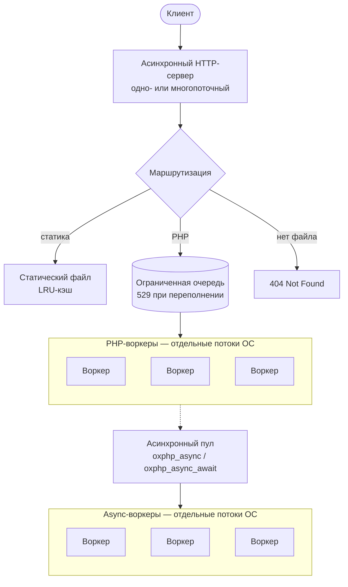

<p align="center">
  
</p>

<h3 align="center">Многопоточный сервер PHP-приложений, созданный для облачной инфраструктуры.</h3>

<p align="center">
  OxPHP — асинхронный сервер PHP-приложений, написанный на Rust.<br>
  Создан для продакшн-нагрузок, требующих низкой задержки, высокой конкурентности и наблюдаемости без дополнительной настройки.
</p>

<p align="center">
  <a href="README.md">English</a> · <b>Русский</b> · <a href="README.zh.md">中文</a>
</p>

<p align="center">
  Documents: <a href="docs/en/">English</a> · <a href="docs/ru/">Русский</a> · <a href="docs/zh/">中文</a>
</p>

<p align="center">
  <a href="#быстрый-старт">Быстрый старт</a> · <a href="#почему-oxphp">Почему OxPHP</a> · <a href="#возможности">Возможности</a> · <a href="#конфигурация">Конфигурация</a> · <a href="#дорожная-карта">Дорожная карта</a>
</p>

<p align="center">
  
  
  
  
  
  
  
  
</p>

---

> [!WARNING]
> **OxPHP пока не готов к продакшну.** Проект активно развивается — API могут меняться, граничные случаи всё ещё выявляются, SLA нет. Но он **готов** для evaluation, staging-окружений и ранних пользователей, которые хотят прогнать его на реальных нагрузках и сообщить, что ломается. Обратная связь, баг-репорты и сравнительные бенчмарки на вашем стеке — это именно то, что нам сейчас нужно: откройте issue или начните обсуждение на GitHub.

## Быстрый старт

Две строчки. Это всё.

```dockerfile
FROM ghcr.io/oxphp/oxphp:0.9.0

COPY --chown=www-data:www-data . /var/www/html/public
```

> **Примечание:** По умолчанию `DOCUMENT_ROOT` равен `/var/www/html/public` — пример выше копирует приложение прямо в document root. Для Laravel, Symfony, Slim и любых проектов с собственным подкаталогом `public/` используйте `COPY --chown=www-data:www-data . /var/www/html`: `public/` фреймворка совпадёт с дефолтным `DOCUMENT_ROOT`.

```bash
docker build -t my-app . && docker run -p 80:80 my-app
curl http://localhost/
```

Без конфигурации nginx. Без настройки пулов PHP-FPM. Без менеджера процессов. Просто ваше приложение.

Подробнее — в полном [руководстве по быстрому старту](docs/ru/getting-started/quick-start.md).

---

## Почему OxPHP?

OxPHP заменяет связку nginx + PHP-FPM одним контейнером. Сервер работает из коробки — TLS, сжатие Brotli, rate limiting, метрики Prometheus, проверки состояния и структурированные JSON-логи настраиваются через переменные окружения.

| | nginx + PHP-FPM | FrankenPHP | RoadRunner | **OxPHP** |
|---|---|---|---|---|
| Язык | C | Go + C | Go | **Rust + C** |
| HTTP/3 | ✅ | ✅ | ✅ experimental | 🔜 в планах |
| TLS 1.3 | ✅ | ✅ | ✅ | ✅ (rustls) |
| Persistent worker state | ❌ | ✅ | ✅ | ✅ |
| Backpressure / HTTP 529 | вручную | ❌ | ❌ | ✅ встроено |
| Метрики Prometheus | плагин | встроено (Caddy admin) | встроенный плагин | ✅ встроено |
| Structured JSON логи | через `log_format` | ✅ | ✅ | ✅ встроено |
| Per-IP rate limiting | встроено | community-модуль | ❌ | ✅ встроено |
| Кастомные страницы ошибок | ✅ (nginx config) | ✅ (Caddyfile) | ❌ | ✅ preload при старте |
| HTTP 103 Early Hints | ✅ (v1.29+) | ✅ | ✅ | 🔜 в планах |
| Memory safety | ❌ (C) | частично (Go + cgo) | ✅ (Go, PHP изолирован через IPC) | частично (Rust + C FFI) |
| WebSocket сервер | ✅ (проксирует) | ✅ (Mercure) | ✅ (centrifuge плагин) | ❌ |
| Реверс-прокси / upstream | ✅ (полноценный) | ✅ (Caddy) | ✅ | ❌ |
| Native install (без Docker) | apt/yum/brew/port | brew, static binary | brew, бинарь | ❌ |
| Платформы (runtime) | Linux/BSD/Win/Mac | Linux/Mac/Win | Linux/Mac/Win | только Linux (glibc/musl) |
| Поддерживаемые версии PHP | 7.4–8.4 | 8.2–8.4 | 7.4–8.4 | только 8.4 (8.5 падает с SIGBUS) |
| Лицензия | BSD-2 / PHP License | Apache-2.0 | MIT | AGPL-3.0 |
| Возраст / production track record | 20+ лет | 2+ года | 7+ лет | <1 года |

Подробнее о возможностях — в [документации](docs/ru/index.md).

---

## Бенчмарки

> Формальные бенчмарки скоро появятся. Мы работаем над воспроизводимым набором тестов, охватывающим req/s, задержки (p50/p99), использование памяти и пропускную способность воркеров под конкурентной нагрузкой.

---

## Возможности

### PHP-среда выполнения
- **Нативное выполнение PHP** — PHP работает непосредственно внутри серверного процесса, в выделенном пуле потоков
- **Полная поддержка суперглобальных переменных**: `$_SERVER`, `$_GET`, `$_POST`, `$_COOKIE`, `$_FILES`, `php://input` — см. [Суперглобальные переменные](docs/ru/php/superglobals.md)
- **HTTP Object API** — `oxphp_http_request()` возвращает типизированный объект запроса с ленивой загрузкой, встроенным парсингом JSON, определением MIME-типов загруженных файлов и мутабельным контейнером атрибутов для middleware — см. [HTTP Request API](docs/ru/php/request-api.md)
- **Worker Runtime API** — `OxPHP\Server\Worker::current()` даёт интроспекцию текущего OS-потока (`id`, `requestCount`, `startTime`, `memoryUsage`, `rss`, `maxMemoryBytes`) и точку входа в цикл обработки запросов (`serve`) — см. [Класс Worker](docs/ru/php/worker-class.md)
- **Общий OPcache** между всеми воркерами — один воркер компилирует файл, остальные используют кешированный байткод — см. [OPcache и JIT](docs/ru/php/opcache.md)
- **PHP-функции расширения** — хелперы `oxphp_*()` для стриминга, раннего ответа, async, трассировки и доступа к запросу — см. [Справочник PHP-функций](docs/ru/php/functions.md)
- **Система плагинов** с типизированной диспетчеризацией событий, приоритетной очерёдностью и регистрацией PHP-функций
- **Атрибутные декораторы** — перехват вызовов функций/методов через атрибуты PHP 8+ с нулевым оверхедом для недекорированного кода; поддержка `TARGET_FUNCTION`, `TARGET_METHOD`, `TARGET_CLASS` — см. [Декораторы](docs/ru/features/decorators.md)
- **Изоляция сбоев** — фатальная ошибка в одном запросе не роняет весь сервер

### Модель воркеров
- **Режим воркера** — постоянные PHP-процессы, живущие между запросами; автозагрузчики, сервисные контейнеры и подключения к БД инициализируются один раз и переиспользуются — см. [Режим воркера](docs/ru/features/worker-mode.md)
- **Мультиплексирование файберов** — каждый воркер обрабатывает несколько конкурентных запросов через PHP 8.4 Fibers; `oxphp_sleep()` и `oxphp_async_await()` уступают текущий файбер вместо блокировки потока воркера — см. [Мультиплексирование файберов](docs/ru/features/fiber-multiplexing.md)
- **Автоматическая рециклизация** по числу запросов или порогу памяти
- **Мониторинг здоровья воркеров** — упавшие воркеры автоматически обнаруживаются и перезапускаются
- **Ранний ответ** через `oxphp_finish_request()` — отправка ответа с продолжением фоновой обработки — см. [Ранний ответ](docs/ru/features/early-response.md)

### Асинхронные промисы
Полное руководство: [Асинхронные промисы](docs/ru/features/async-promises.md).

- **`oxphp_async()` / `oxphp_async_await()`** — отправка замыканий в выделенный пул потоков для настоящего параллельного выполнения
- **Портативная сериализация** `use`-переменных, аргументов и возвращаемых значений — безопасная бинарная передача между потоками
- Поддерживаемые типы: скаляры, строки, массивы (вложенные). Ресурсы и объекты отклоняются с `E_WARNING`
- **Безопасность исключений и die()** — исключения, `die()` и `exit()` перехватываются и повторно выбрасываются как `OxPHP\Async\AsyncException`
- **Поддержка таймаутов** — таймауты для каждой задачи с `OxPHP\Async\TimeoutException`
- **`oxphp_async_await_all()` / `oxphp_async_await_race()` / `oxphp_async_await_any()`** — пакетный, гоночный (первый завершившийся) и any-примитив (первый успешно завершившийся, в стиле JS `Promise.any`)

### Разделяемое состояние (`OxPHP\Shared\*`)
Конкурентные примитивы уровня процесса — позволяют PHP-воркерам координировать изменяемое состояние без Redis, Memcached или APCu. Всё внутри процесса: стоимость операции — микросекунды, а не сетевой round-trip. Полное руководство: [Разделяемое состояние](docs/ru/shared-state/shared-state.md), [справочник наблюдаемости](docs/ru/shared-state/shared-observability.md).

- **`Shared\Counter`** — атомарный int64-аккумулятор (`get`, `set`, `add`, `compareAndSet`) — см. [Counter](docs/ru/shared-state/shared-counter.md)
- **`Shared\Atomic`** — полноценный lock-free int64-примитив (`load`, `store`, `swap`, `compareAndSet`, `fetchAdd/Sub/And/Or/Xor`) с явным memory ordering — см. [Atomic](docs/ru/shared-state/shared-atomic.md)
- **`Shared\Flag`** — атомарный bool с `compareAndSet` для one-shot переходов — см. [Flag](docs/ru/shared-state/shared-flag.md)
- **`Shared\Once`** — контейнер однократной инициализации с reentrancy-safe фабрикой — см. [Once](docs/ru/shared-state/shared-once.md)
- **`Shared\Mutex`** — отравляемый мьютекс над хранимым значением, с reentrancy и кросс-поточной детекцией дедлоков — см. [Mutex](docs/ru/shared-state/shared-mutex.md)
- **`Shared\Channel`** — ограниченная MPMC-очередь, fiber-aware (блокирующий recv уступает текущий файбер) — см. [Channel](docs/ru/shared-state/shared-channel.md)
- **`Shared\Map`** — конкурентное key-value хранилище со строковыми ключами, batched `setMany`/`getMany` и cycle-check для вложенных значений — см. [Map](docs/ru/shared-state/shared-map.md)
- **`Shared\Pool`** — ограниченный пул объектов с строгим per-thread affinity, идл-таймаут эвикцией и chaos-reclaim при гибели воркера — см. [Pool](docs/ru/shared-state/shared-pool.md)
- **`Shared\Registry`** — name-keyed handle (`Registry::counter('hits', fn() => ...)`), чтобы каждый воркер и каждый запрос сходились на одной и той же записи без внешних хранилищ — см. [Registry](docs/ru/shared-state/shared-registry.md)
- **Встроенная наблюдаемость** — Prometheus-метрики `oxphp_shared_*` и JSON-эндпоинты `/__ox_shared/{summary,entries,entry,preview,types,graph}` на внутреннем порту
- **Refcount + lifecycle-safety** — handle не может пережить запись в реестре; cycle-детектор отвергает графы, которые привели бы к утечке памяти
- Когда перерастёте, см. [Миграция на внешнее хранилище](docs/ru/shared-state/migrating-to-external-store.md)

### HTTP и сетевое взаимодействие
- **HTTP/1.1 + HTTP/2 на одном порту** — протокол определяется автоматически для каждого соединения: h2c по prior-knowledge поверх незашифрованного соединения или `h2` через ALPN под TLS, с прозрачным откатом на HTTP/1.1. Окна управления потоком подобраны под типичные размеры PHP-ответов — см. [HTTP/2](docs/ru/features/tls.md#http2)
- **TLS 1.3** с ALPN — HTTP/2 и HTTP/1.1 поверх TLS — см. [TLS](docs/ru/features/tls.md)
- **3 режима маршрутизации** — Traditional (отображение файлов + всегда-on PATH_INFO), Framework (rewrite на `index.php` с `PATH_INFO=$request_uri`), SPA (`index.html` для путей без расширения, жёсткий 404 для отсутствующих ассетов). Каждый режим воспроизводит знакомую конфигурацию nginx `try_files` — см. [Маршрутизация](docs/ru/features/routing.md)
- **Потоковая передача SSE** через автоопределение `Content-Type: text/event-stream` или `oxphp_stream_flush()` — кооперативная с мультиплексированием файберов — см. [Server-Sent Events](docs/ru/features/sse.md)
- **Настраиваемые таймауты** — чтение заголовков, обработка запроса, keep-alive — см. [Таймауты](docs/ru/features/timeouts.md)

### Производительность
- **LRU-кэш статических файлов** (в памяти для файлов ≤1 МБ, потоковая отдача для больших) — см. [Статические файлы](docs/ru/features/static-files.md)
- **HTTP-кеширование** с ETag, Last-Modified и поддержкой 304 Not Modified
- **Сжатие Brotli** для текстовых ответов (диапазон 256 Б – 3 МБ) — см. [Сжатие](docs/ru/features/compression.md)
- **Аллокатор mimalloc** для снижения задержки выделения памяти под нагрузкой
- **Настраиваемые потоки HTTP-сервера** — многопоточный по умолчанию (CPU/2), настраивается через `TOKIO_WORKERS`

### Наблюдаемость
Полное руководство: [Распределённая трассировка](docs/ru/features/distributed-tracing.md).

- **W3C Trace Context** — автоматический пропуск `traceparent`/`tracestate`, `$_SERVER['OXPHP_TRACE_ID']` для корреляции PHP-логов
- **OpenTelemetry** — экспорт спанов OTLP (gRPC/HTTP) с семантическими конвенциями, настраиваемым семплированием, пакетной обработкой
- **Автоинструментирование APM** — внутренние PHP-функции в PDO, mysqli, cURL, Redis, Memcached и файловом I/O перехвачены на уровне движка; каждый вызов становится спаном без изменений кода
- **Декоратор `#[OxPHP\Apm\Trace]`** — пометьте любую функцию или метод атрибутом PHP 8 для автоматического создания спанов
- **PHP tracing SDK** — 10 функций `oxphp_apm_*()` (`start`, `end`, `attribute`, `event`, `error`, `status`, `header`, `trace`, `trace_id`, `span_id`) для ручного создания спанов, атрибутов, событий, записи ошибок и передачи контекста трассировки
- **Метрики Prometheus** на `/metrics` — по каждому воркеру, без зависимостей — см. [Метрики](docs/ru/operations/metrics.md)
- **Проверка работоспособности** на `/health` — готова для проб готовности K8s — см. [Health checks](docs/ru/operations/health-checks.md)
- **Внутренний сервер** на отдельном порту для health, metrics и runtime-конфига — см. [Внутренний сервер](docs/ru/features/internal-server.md)
- **Структурированное логирование ошибок** — ошибки PHP попадают в серверный лог с полями `php_error_type`, `php_file`, `php_line`
- **JSON-журнал доступа** с опциональными полями `trace_id`/`span_id` (уровни: `all`, `error`, выключен через `ACCESS_LOG`) — см. [Журнал доступа](docs/ru/features/access-logging.md)
- **Генерация Request ID** и проброс (`X-Request-ID`); формат на основе трейсов при активном OTel — см. [Request ID](docs/ru/features/request-ids.md)

### Профилирование (фича `plugin-profiler`)

Полное руководство: [Профилирование](docs/ru/features/profiling.md).

- **Захват профиля на каждый запрос** — триггер через cookie (`OXPROF`), заголовок (`X-OxPHP-Profile`), параметр запроса (`?__oxprof=`) или статистическую выборку (`PROFILER_SAMPLE_RATE`); сравнение токена за константное время
- **Четыре формата экспорта** — xhprof (для xhgui), speedscope (для speedscope.app), pprof (инструменты Go / Pyroscope), collapsed (FlameGraph)
- **Подробные данные спанов** — wall-time, CPU-time, память (вход/выход), события, атрибуты — наносекундная точность на всём конвейере
- **PHP SDK** — 7 функций (`OxPHP\Profile\{start, stop, pause, resume, mark, metric, is_active}`) + 7 атрибутов (4 observer-фильтра: `#[Profile]` / `#[Exclude]` / `#[Sample]` / `#[Tag]`; 3 декоратора: `#[Mark]` / `#[SlowThreshold]` / `#[MemoryThreshold]`)
- **Общее дерево с APM** — оба плагина читают одно `Arc<SpanTree>`; дублирования сбора нет; APM продолжает отправлять в OTel только явные спаны, а профилировщик сохраняет полное дерево
- **LRU в памяти + хранение на диске** — последние `PROFILER_RETENTION_COUNT` запусков всегда доступны, запись с rate-limit через token-bucket, неблокирующая фоновая обрезка каждые 5 с с атомарным rename
- **HTTP push** — отправка профилей в xhgui или любой коллектор; 3× повторных попыток с экспоненциальной задержкой (100/200/400 мс) и бюджетом 5 с wallclock; автоопределение xhgui-конверта
- **Внутренние HTTP-маршруты** на `/__profiler/` — 8 эндпоинтов (list / metadata / raw / 302 на speedscope / DELETE / config / stats / landing) с опциональной bearer-аутентификацией и защитой от path traversal
- **Метрики Prometheus** — 6 счётчиков + 1 gauge (runs, spans, bytes, disk drops, push failures, truncated, in-memory runs) через `/metrics`

### Надёжность и эксплуатация
- **Ограниченная очередь запросов** с противодавлением (529) при переполнении
- **Ограничение частоты запросов по IP** с заголовками `X-RateLimit-*` и ответами 429 — см. [Rate limiting](docs/ru/features/rate-limiting.md)
- **Пользовательские страницы ошибок** — загружаются при старте, без I/O на горячем пути — см. [Страницы ошибок](docs/ru/features/error-pages.md)
- **Graceful shutdown** — запросы в обработке завершаются в течение `DRAIN_TIMEOUT_SECONDS` при SIGTERM/SIGINT — см. [Плавная остановка](docs/ru/operations/graceful-shutdown.md)
- **Защита от path traversal** — обнаружение выхода за пределы через симлинки — см. [Разрешённые цели симлинков](docs/ru/security/symlink-allow-paths.md)
- **Доверенные прокси** — извлечение реального IP клиента из `Forwarded` (RFC 7239) и `X-Forwarded-*` заголовков с CIDR-доверием — см. [Доверенные прокси](docs/ru/security/trusted-proxies.md)
- **Блокировка dot-path** — возвращает 404 для скрытых файлов (`.env`, `.git/`) с исключением `.well-known` (RFC 8615) — см. [Блокировка dot-path](docs/ru/security/dot-path-blocking.md)
- **Запуск в контейнере без прав root** от имени www-data (UID 82)

---

## Архитектура



- **Асинхронный HTTP-сервер** — многопоточный по умолчанию, настраивается через `TOKIO_WORKERS`
- **Пул PHP-воркеров** — каждый воркер — отдельный поток ОС; сбой в одном воркере не влияет на остальные
- Запросы ожидают в ограниченной очереди между HTTP-сервером и PHP-воркерами; очередь возвращает 529 при переполнении
- **Асинхронный пул** — отдельные потоки для задач `oxphp_async()`, предотвращающие замедление основного пула воркеров
- **Режим воркера** — постоянные PHP-процессы, живущие между запросами; автозагрузчики и подключения к БД переиспользуются всеми запросами, обрабатываемыми данным воркером

### Внутренний сервер

Если задана переменная `INTERNAL_ADDR`, на отдельном порту запускается легковесный HTTP-сервер:

| Эндпоинт | Описание |
|----------|-------------|
| `GET /health` | Статус работоспособности в формате JSON (аптайм, запросы, соединения) |
| `GET /metrics` | Метрики в текстовом формате Prometheus |
| `GET /config` | Конфигурация runtime в формате JSON (пути к TLS-файлам скрыты; `internal_addr` и `error_pages_dir` не выводятся) |

Значение `INTERNAL_ADDR` только с портом (например `:9090`) биндится на loopback; указывайте `0.0.0.0:9090`, только чтобы открыть сервер наружу. Если слушатель доступен извне без `INTERNAL_ALLOW_IPS`, сервер пишет предупреждение при старте. Контроль доступа — сетевая изоляция плюс CIDR-список `INTERNAL_ALLOW_IPS`; bearer-токена нет намеренно, поскольку токен провоцирует открыть порт «раз он защищён». Health-пробы доступны всегда, чтобы проверки liveness/readiness оркестратора не ломались.

### Конвейер трассировки (`plugin-otel` + `plugin-apm`)

APM зависит от OTel и использует его `TracerProvider` через реестр сервисов плагинов. Сбор спанов происходит в PHP-воркере; экспорт OTLP выполняется вне горячего пути через `tokio::spawn`.


- **Trace context** генерируется первым (приоритет `-95`) при `TRACE_CONTEXT=true` (автоматически включается OTel). Request-хендлер OTel работает на `-80` и пишет `start_us`; хендлер APM — на `-70`.
- **Сбор спанов thread-local** — у каждого PHP-воркера свой `SPAN_STACK`. APM-хуки, декоратор `#[Trace]` и SDK `oxphp_trace_*()` пушат в один и тот же стек; дочерние спаны сериализуются в JSON в конце запроса.
- **Общий `TracerProvider`** — OTel регистрирует `otel.provider` как сервис плагина; APM получает тот же `Arc<OnceLock<TracerProvider>>`, оба плагина экспортируют в один batch-процессор.
- **Экспорт вне горячего пути** — оба complete-хендлера делают `tokio::spawn`, HTTP-ответ отдаётся клиенту до отправки спанов.
- **Жизненный цикл провайдера** — OTel инициализирует `BatchSpanProcessor` в `on_ready()` (после запуска Tokio-runtime). При остановке `force_flush()` + `shutdown()` сбрасывают оставшиеся спаны.

---

## Конфигурация

Все настройки задаются через переменные окружения — файлы конфигурации не требуются.

Самое необходимое — то, что нужно большинству развёртываний, чтобы поднять сервис:

| Переменная | По умолчанию | Описание |
|---|---|---|
| `LISTEN_ADDR` | `0.0.0.0:80` | Адрес и порт для прослушивания |
| `DOCUMENT_ROOT` | `/var/www/html/public` | Путь в файловой системе для раздачи файлов |
| `ENTRY_FILE` | *(не задано)* | Единый канонический entry-скрипт. Не задано = Traditional, `*.php` = Framework, не-`.php` = SPA. Резолвится относительно `DOCUMENT_ROOT` |
| `WORKER_MODE_ENABLED` | `false` | Включает режим постоянных воркеров. Требует, чтобы `ENTRY_FILE` указывал на `.php`-скрипт |
| `INTERNAL_ADDR` | *(не задано)* | Внутренний сервер для health/metrics/config. Значение только с портом, например `:9090`, биндится на `127.0.0.1`; используйте `0.0.0.0:9090`, чтобы открыть наружу |
| `INTERNAL_ALLOW_IPS` | *(не задано)* | Список CIDR через запятую, которым разрешён доступ к `/metrics`, `/config` и другим внутренним путям. Health-эндпоинты (`/health`, `/healthz`, `/readyz`, `/startupz`, …) разрешены всегда. Пусто = разрешить всем. Loopback не подразумевается — укажите `127.0.0.1/32`, чтобы сохранить доступ с localhost |
| `TLS_CERT` | *(не задано)* | Путь к PEM-файлу TLS-сертификата |
| `TLS_KEY` | *(не задано)* | Путь к PEM-файлу закрытого ключа TLS |
| `SUPERGLOBALS_ENABLED` | `true` | Заполнять `$_GET`, `$_POST`, `$_COOKIE`, `$_FILES`, `$_SERVER`; установите `false`, чтобы использовать только `oxphp_http_request()` |
| `ASYNC_WORKERS` | `0` (отключено) | Выделенные потоки асинхронных воркеров для `oxphp_async()` |

Пул воркеров, очередь, rate limiting, таймауты, тонкая настройка TLS, кеширование статических файлов, сжатие, журналы доступа, доверенные прокси, правила запрета выполнения PHP и все переменные уровня плагинов вынесены в консолидированный справочник — см. [Конфигурация](docs/ru/operations/configuration.md) для полной таблицы.

> **Булевы значения** (регистронезависимо, лишние пробелы обрезаются): truthy = `on` / `true` / `1` / `yes`; falsy = `off` / `false` / `0` / `no`. Любое непустое значение вне этого набора — например, опечатки вроде `ture` — приводит к ошибке на старте с указанием имени переменной. Незаданная переменная или пустое присваивание (`FOO=`) откатывается к значению по умолчанию, поэтому подстановки Docker Compose / Kubernetes вида `FOO=${FOO}` работают корректно, когда переменная хоста отсутствует.

### OpenTelemetry, APM и Shared State

Переменные уровня плагинов (семейства `OTEL_*`, `OTEL_APM_*` и `SHARED_*`) живут в консолидированном справочнике конфигурации — единый источник правды:

- **OpenTelemetry** (`plugin-otel`): [Конфигурация → OpenTelemetry](docs/ru/operations/configuration.md#opentelemetry). Pipeline экспорта end-to-end описан в [Руководстве по распределённой трассировке](docs/ru/features/distributed-tracing.md).
- **APM** (`plugin-apm`): [Конфигурация → APM](docs/ru/operations/configuration.md#apm). Требуется `OTEL_ENABLED=true`.
- **Shared State** (`plugin-shared`): [Конфигурация → Shared State](docs/ru/operations/configuration.md#shared-state). Концептуальное руководство — в [гайде по разделяемому состоянию](docs/ru/shared-state/shared-state.md).

---

## Сборка

```bash
# На хосте (без PHP — все тесты проходят, без выполнения PHP)
cargo build --release

# Через Docker (с PHP — полная функциональность)
docker compose build
```

### Локальный запуск (только статические файлы)

```bash
DOCUMENT_ROOT=./www/public ./target/release/oxphp
```

## Дорожная карта

> Элементы не упорядочены по приоритету. Наличие в этом списке не гарантирует реализацию.

| Feature | Описание |
|---|---|
| ~~**Trace Context (W3C)**~~ | ✅ Реализовано — автоматическая передача заголовков `traceparent` / `tracestate` (спецификация W3C), включается через `TRACE_CONTEXT=true` |
| ~~**OpenTelemetry**~~ | ✅ Реализовано — экспорт трейсов OTLP через feature `plugin-otel`, пропуск контекста W3C, спаны для каждого запроса со стандартными семантическими конвенциями |
| ~~**APM & Auto-Instrumentation**~~ | ✅ Реализовано — feature `plugin-apm`: автоматическая трассировка внутренних PHP-функций в PDO, mysqli, cURL, Redis, Memcached и файловом I/O, декоратор `#[OxPHP\Apm\Trace]`, 10 SDK-функций `oxphp_apm_*()`, захват ошибок PHP |
| **Custom Metrics** | PHP API для регистрации пользовательских метрик Prometheus из кода приложения |
| ~~**Built-in PHP Profiler**~~ | ✅ Реализовано — фича `plugin-profiler`: профилирование на каждый запрос с форматами xhprof/speedscope/pprof/collapsed, PHP SDK, триггеры-атрибуты, LRU в памяти + хранение на диске, HTTP push в xhgui, внутренние маршруты `/__profiler/`, метрики Prometheus — см. [Профилирование](docs/ru/features/profiling.md) |
| **Dockerfile.bookworm** | Официальный образ на базе Debian Bookworm как альтернатива Alpine |
| **Non-Docker Install** | *(предварительно)* Нативная установка через системные пакетные менеджеры (apt, brew и т.д.) |
| **HTTP/3** | Поддержка HTTP/3 на базе QUIC |
| **HTTP 103 Early Hints** | Отправка ответов `103 Early Hints`, позволяющих клиентам предварительно загружать ресурсы до получения финального ответа |
| **Ecosystem Plugins** | Расширенная система плагинов: больше хуков жизненного цикла, более богатый PHP API и документация для сторонних авторов плагинов |
| ~~**Shared Async Runtime**~~ | ✅ Реализовано — один и тот же асинхронный runtime обеспечивает работу как HTTP-сервера, так и `oxphp_async()` / `oxphp_async_await()` с тайм-аутами, доставкой результатов и координацией гонки |
| ~~**Promise API**~~ | ✅ Реализовано — `oxphp_async()` / `oxphp_async_await()` с выделенным пулом потоков, портативной сериализацией и безопасностью исключений |
| ~~**Fiber Multiplexing**~~ | ✅ Реализовано — каждый воркер обрабатывает несколько конкурентных запросов через PHP 8.4 Fibers; `oxphp_sleep()` / `oxphp_usleep()` и `oxphp_async_await()` кооперативно уступают файбер |
| **Diagnostics** | Диагностика для продакшна: проверка лимитов ОС (ulimit, TCP backlog, epoll/kqueue, параметры контейнера), выявление узких мест производительности (глубина очереди воркеров, конкуренция за блокировки, нагрузка GC/аллокатора, статистика ZTS) и конкретные рекомендации по устранению |
| **TLS hot-reload** | Перезагрузка TLS-сертификата и ключа без рестарта — совместимо с короткоживущей ротацией cert-manager / SPIRE / istiod, убирает обходной путь «rolling restart на каждую ротацию» |
| **SPIFFE Workload API** | Нативный клиент SPIFFE/SPIRE workload identity: стриминг SVID через Unix-сокет с криптографической нодовой аттестацией — как opt-in альтернатива дистрибуции сертификатов через file-mount |
| **FIPS-validated TLS** | Cargo-фича для переключения с `rustls` + `ring` на `rustls` + `aws-lc-rs` с фичей `fips` для соответствия FIPS 140-2 / 140-3 в регулируемых deployments |

## Документация

- [English](docs/en/)
- [Русский](docs/ru/)
- [中文](docs/zh/)

## Лицензия

[AGPL-3.0](LICENSE)

---

<p align="center"><sub><i>Создано и развивается с помощью ИИ под тщательным руководством человека.</i></sub></p>
