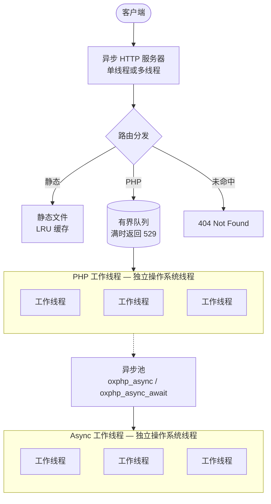
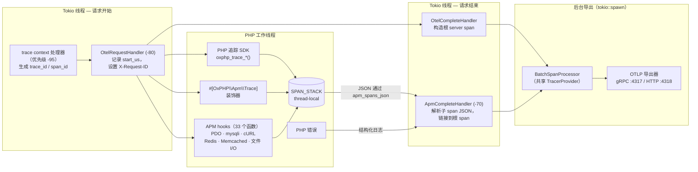

<p align="center">
  
</p>

<h3 align="center">为云原生基础设施打造的多线程 PHP 应用服务器。</h3>

<p align="center">
  OxPHP 是一个用 Rust 编写的异步 PHP 应用服务器 ——<br>
  专为对低延迟、高并发和零配置可观测性有严格要求的生产工作负载而构建。
</p>

<p align="center">
  <a href="README.md">English</a> · <a href="README.ru.md">Русский</a> · <b>中文</b>
</p>

<p align="center">
  Documents: <a href="docs/en/">English</a> · <a href="docs/ru/">Русский</a> · <a href="docs/zh/">中文</a>
</p>

<p align="center">
  <a href="#快速开始">快速开始</a> · <a href="#为什么选择-oxphp">为什么选择 OxPHP</a> · <a href="#功能特性">功能特性</a> · <a href="#配置">配置</a> · <a href="#路线图">路线图</a>
</p>

<p align="center">
  
  
  
  
  
  
  
  
</p>

---

## 快速开始

两行命令，仅此而已。

```dockerfile
FROM ghcr.io/oxphp/oxphp:0.2.0

COPY --chown=www-data:www-data . /var/www/html
```

> **注意：** 默认情况下，`DOCUMENT_ROOT` 为 `/var/www/html/public`。请将入口脚本（如 `index.php`）放在 `public/` 子目录中。OxPHP 将从该目录提供文件服务，而非 `/var/www/html` 根目录。这与 Laravel、Symfony 和 Slim 的标准目录布局一致。

```bash
docker build -t my-app . && docker run -p 80:80 my-app
curl http://localhost/
```

无需 nginx 配置。无需 PHP-FPM 进程池调优。无需进程管理器。只需你的应用。

完整指南请参阅[快速开始](docs/zh/getting-started/quick-start.md)。

---

## 为什么选择 OxPHP？

OxPHP 用一个容器替代 nginx + PHP-FPM。服务器开箱即用 —— TLS、Brotli 压缩、限流、Prometheus 指标、健康检查和结构化 JSON 日志均通过环境变量配置。

| | nginx + PHP-FPM | FrankenPHP | RoadRunner | **OxPHP** |
|---|---|---|---|---|
| 语言 | C | Go + C | Go | **Rust + C** |
| HTTP/2 | ✅ | ✅ | ✅ | ✅ |
| HTTP/3 | ✅ | ✅ | ✅ 实验性 | 🔜 路线图 |
| TLS 1.3 | ✅ | ✅ | ✅ | ✅ (rustls) |
| 持久化 worker 状态 | ❌ | ✅ | ✅ | ✅ |
| 背压 / HTTP 529 | 手动 | ❌ | ❌ | ✅ 内置 |
| Prometheus 指标 | 插件 | 内置 (Caddy admin) | 内置插件 | ✅ 内置 |
| 结构化 JSON 日志 | 通过 `log_format` | ✅ | ✅ | ✅ 内置 |
| 按 IP 限流 | 内置 | 社区模块 | ❌ | ✅ 内置 |
| 自定义错误页 | ✅ (nginx config) | ✅ (Caddyfile) | ❌ | ✅ 启动时预加载 |
| HTTP 103 Early Hints | ✅ (v1.29+) | ✅ | ✅ | 🔜 路线图 |
| 内存安全 | ❌ (C) | 部分 (Go + cgo) | ✅ (Go，PHP 通过 IPC 隔离) | 部分 (Rust + C FFI) |
| WebSocket 服务器 | ✅ (代理) | ✅ (Mercure) | ✅ (centrifuge 插件) | ❌ |
| 反向代理 / upstream | ✅ (完整) | ✅ (Caddy) | ✅ | ❌ |
| 原生安装（非 Docker） | apt/yum/brew/port | brew, static binary | brew, 二进制 | 路线图 |
| 运行平台 | Linux/BSD/Win/Mac | Linux/Mac/Win | Linux/Mac/Win | 仅 Linux (glibc/musl) |
| 支持的 PHP 版本 | 7.4–8.4 | 8.2–8.4 | 7.4–8.4 | 仅 8.4 (8.5 会 SIGBUS 崩溃) |
| 许可证 | BSD-2 / PHP License | Apache-2.0 | MIT | AGPL-3.0 |
| 年龄 / 生产使用历史 | 20+ 年 | 2+ 年 | 7+ 年 | <1 年 |

详细功能介绍请参阅[文档](docs/zh/index.md)。

---

## 基准测试

> 正式基准测试即将推出。我们正在开发一套可复现的测试套件，涵盖 req/s、延迟（p50/p99）、内存使用以及并发负载下的工作池吞吐量。

---

## 功能特性

### PHP 运行时
- **原生 PHP 执行** — PHP 直接在服务器进程内运行，使用专用线程池
- **完整超全局变量**支持：`$_SERVER`、`$_GET`、`$_POST`、`$_COOKIE`、`$_FILES`、`php://input` — 参见 [超全局变量](docs/zh/php/superglobals.md)
- **HTTP Object API** — `oxphp_http_request()` 返回类型化、惰性加载的请求对象，内置 JSON 请求体解析、基于文件内容的 MIME 类型检测以及用于中间件的可变属性容器 — 参见 [HTTP Request API](docs/zh/php/request-api.md)
- **跨工作线程共享 OPcache** — 一个工作线程编译文件，其余线程复用缓存字节码 — 参见 [OPcache 与 JIT](docs/zh/php/opcache.md)
- **PHP 扩展函数** — `oxphp_*()` 辅助函数，用于流式传输、提前响应、异步、追踪和请求访问 — 参见 [PHP 函数参考](docs/zh/php/functions.md)
- **插件系统** — 支持类型化事件分发、优先级排序及 PHP 函数注册
- **基于属性的装饰器** — 通过 PHP 8+ 属性拦截函数/方法调用，对未装饰代码零开销；支持 `TARGET_FUNCTION`、`TARGET_METHOD`、`TARGET_CLASS` — 参见 [装饰器](docs/zh/features/decorators.md)
- **故障隔离** — 单个请求中的致命错误不会导致服务器整体崩溃

### 工作进程模型
- **工作进程模式** — 持久化 PHP 进程，跨请求保持存活；自动加载器、服务容器和数据库连接只初始化一次并被复用 — 参见 [工作进程模式](docs/zh/features/worker-mode.md)
- **Fiber 多路复用** — 每个工作线程通过 PHP 8.4 Fiber 处理多个并发请求；`oxphp_sleep()` 和 `oxphp_async_await()` 让出当前 Fiber 而非阻塞工作线程 — 参见 [Fiber 多路复用](docs/zh/features/fiber-multiplexing.md)
- **自动回收** — 按请求数或内存阈值自动回收工作进程
- **工作线程健康监控** — 自动检测崩溃线程并重启
- **提前响应** — 通过 `oxphp_finish_request()` 立即发送响应并继续后台处理 — 参见 [提前响应](docs/zh/features/early-response.md)

### 异步 Promise
完整指南：[异步 Promise](docs/zh/features/async-promises.md)。

- **`oxphp_async()` / `oxphp_async_await()`** — 将闭包分发到专用线程池进行真正的并行执行
- **可移植序列化** — `use` 变量、参数和返回值安全跨线程二进制传输
- 支持类型：标量、字符串、数组（嵌套）。资源和对象将被拒绝并触发 `E_WARNING`
- **异常与 die() 安全** — 异常、`die()` 和 `exit()` 被捕获并重新抛出为 `OxPHP\Async\Exception`
- **超时支持** — 每任务超时，抛出 `OxPHP\Async\TimeoutException`
- **`oxphp_async_await_all()` / `oxphp_async_await_any()`** — 批量等待和竞速原语

### HTTP 与网络
- **HTTP/1.1 + HTTP/2** 自动协议协商（h2c）
- **TLS 1.3** 支持 ALPN —— HTTP/2 和 HTTP/1.1 均可通过 TLS 运行 — 参见 [TLS](docs/zh/features/tls.md)
- **3 种路由模式** — Traditional（文件映射 + 始终启用 PATH_INFO）、Framework（重写到 `index.php`，`PATH_INFO=$request_uri`）、SPA（无扩展名路径返回 `index.html`，缺失资源硬 404）。每种模式都对应熟悉的 nginx `try_files` 配置 — 参见 [路由](docs/zh/features/routing.md)
- **SSE 流式传输** — 通过自动检测 `Content-Type: text/event-stream` 或 `oxphp_stream_flush()` 实现 —— 与 Fiber 多路复用协作运行 — 参见 [Server-Sent Events](docs/zh/features/sse.md)
- **可配置超时** — 请求头读取、整体请求及 keep-alive 超时 — 参见 [超时](docs/zh/features/timeouts.md)

### 性能
- **LRU 文件缓存** — 静态文件内存缓存（≤1 MB 完整缓存，更大文件流式传输） — 参见 [静态文件](docs/zh/features/static-files.md)
- **HTTP 缓存** — 支持 ETag、Last-Modified 和 304 Not Modified 条件请求
- **Brotli 压缩** — 对文本响应启用（范围：256 B – 3 MB） — 参见 [压缩](docs/zh/features/compression.md)
- **mimalloc** 分配器 — 降低高并发下的内存分配延迟
- **可配置 HTTP 服务器线程** — 默认多线程（CPU / 2），可通过 `TOKIO_WORKERS` 调整

### 可观测性
完整指南：[分布式追踪](docs/zh/features/distributed-tracing.md)。

- **W3C Trace Context** — 自动传播 `traceparent`/`tracestate`，`$_SERVER['OXPHP_TRACE_ID']` 用于 PHP 日志关联
- **OpenTelemetry** — 通过 `plugin-otel` 特性进行 OTLP Span 导出（gRPC/HTTP），支持语义化约定、可配置采样和批处理
- **APM 自动埋点** — 在引擎层面 hook 33 个 PHP 内部函数（PDO、mysqli、cURL、Redis、Memcached、文件 I/O）；每次调用自动成为 Span，无需修改代码
- **`#[OxPHP\Tracing\Trace]` 装饰器** — 通过 PHP 8 属性注解任意函数或方法，自动创建 Span
- **PHP 追踪 SDK** — 10 个 `oxphp_trace_*()` 函数，支持手动创建 Span、设置属性、记录事件、错误记录和追踪上下文传播
- **Prometheus 指标** — 通过 `/metrics` 暴露，按工作进程统计，零外部依赖 — 参见 [指标](docs/zh/operations/metrics.md)
- **健康检查**端点 `/health` — 支持 K8s 就绪探针 — 参见 [健康检查](docs/zh/operations/health-checks.md)
- **内部服务器** 在独立端口上提供 health、metrics 和运行时配置 — 参见 [内部服务器](docs/zh/features/internal-server.md)
- **结构化错误日志** — PHP 错误输出到服务器日志，包含 `php_error_type`、`php_file`、`php_line` 字段
- **JSON 访问日志** — 可选 `trace_id`/`span_id` 字段（级别：`all`、`error`，通过 `ACCESS_LOG` 控制） — 参见 [访问日志](docs/zh/features/access-logging.md)
- **请求 ID** 生成与透传（`X-Request-ID`）；OTel 启用时使用追踪衍生格式 — 参见 [请求 ID](docs/zh/features/request-ids.md)

### 可靠性与运维
- **有界请求队列** — 队列满时返回 529 进行背压控制
- **基于 IP 的限流** — 携带 `X-RateLimit-*` 响应头，超限返回 429 — 参见 [限流](docs/zh/features/rate-limiting.md)
- **自定义错误页面** — 启动时预加载，热路径零 I/O — 参见 [错误页](docs/zh/features/error-pages.md)
- **优雅关闭** — 在 SIGTERM/SIGINT 后，进行中的请求会在 `DRAIN_TIMEOUT_SECONDS` 内排空 — 参见 [优雅关闭](docs/zh/operations/graceful-shutdown.md)
- **路径穿越防护** — 包含符号链接逃逸检测
- **受信任代理** — 通过 CIDR 信任从 `Forwarded`（RFC 7239）和 `X-Forwarded-*` 头中提取真实客户端 IP — 参见 [受信任代理](docs/zh/security/trusted-proxies.md)
- **dot-path 阻止** — 对隐藏文件（`.env`、`.git/`）返回 404，`.well-known` 例外（RFC 8615） — 参见 [dot-path 阻止](docs/zh/security/dot-path-blocking.md)
- **非 root 容器**运行 — 以 www-data（UID 82）身份执行

---

## 架构



- **异步 HTTP 服务器** — 默认多线程，可通过 `TOKIO_WORKERS` 调整
- **PHP 工作池** — 每个工作线程为独立操作系统线程；一个工作线程崩溃不影响其他线程
- 请求在 HTTP 服务器与 PHP 工作线程之间的有界队列中等待；队列满时返回 529
- **异步池** — `oxphp_async()` 任务使用独立线程，防止主工作池出现性能瓶颈
- **工作进程模式** — 持久化 PHP 进程，跨请求保持存活；自动加载器和数据库连接由该工作线程处理的所有请求共享

### 内部服务器

设置 `INTERNAL_ADDR` 后，将在独立端口上启动一个轻量 HTTP 服务器：

| 端点 | 描述 |
|----------|-------------|
| `GET /health` | JSON 格式健康状态（运行时长、请求数、连接数） |
| `GET /metrics` | Prometheus 文本格式指标 |
| `GET /config` | JSON 格式运行时配置（TLS 路径已脱敏） |

### 追踪管道（`plugin-otel` + `plugin-apm`）

APM 依赖 OTel，并通过插件服务注册表共享其 `TracerProvider`。Span 收集发生在 PHP 工作线程上；OTLP 导出通过 `tokio::spawn` 在热路径之外执行。



- **Trace context** 最先生成（优先级 `-95`），在 `TRACE_CONTEXT=true` 时启用（由 OTel 自动打开）。OTel 的 request handler 运行在 `-80` 并记录 `start_us`；APM 的 handler 运行在 `-70`。
- **Span 收集是 thread-local 的** — 每个 PHP 工作线程拥有各自的 `SPAN_STACK`。APM hooks、`#[Trace]` 装饰器以及 `oxphp_trace_*()` SDK 都压入同一个栈；请求结束时子 span 会序列化为 JSON。
- **共享 `TracerProvider`** — OTel 将 `otel.provider` 注册为插件服务；APM 获取同一个 `Arc<OnceLock<TracerProvider>>`，两个插件写入同一个 batch 处理器。
- **热路径外导出** — 两个 complete handler 都使用 `tokio::spawn`，HTTP 响应在 span 发送之前返回给客户端。
- **Provider 生命周期** — OTel 在 `on_ready()`（Tokio 运行时启动之后）初始化 `BatchSpanProcessor`。关闭时 `force_flush()` + `shutdown()` 会排空剩余 span。

---

## 配置

所有配置均通过环境变量设置 —— 无需配置文件。

| 变量 | 默认值 | 描述 |
|---|---|---|
| `LISTEN_ADDR` | `0.0.0.0:80` | 监听地址和端口 |
| `DOCUMENT_ROOT` | `/var/www/html/public` | 静态文件服务的根目录路径 |
| `INDEX_FILE` | *(未设置)* | 路由模式：空 = Traditional，`*.php` = Framework，其他任何值 = SPA |
| `TOKIO_WORKERS` | `0`（CPU / 2，最少 1） | 处理连接的 HTTP 服务器线程数；`0` = 自动 |
| `EXECUTOR` | `sapi` | PHP 执行器：`sapi`（真实 PHP）或 `stub`（测试模式） |
| `PHP_WORKERS` | `0`（CPU / 2，最少 1） | 工作池模式：`N` = 固定数量，`MIN:MAX` = 动态伸缩，`0` = 自动 |
| `PHP_WORKERS_IDLE_SECONDS` | `30` | 动态模式下工作线程的空闲超时时间 |
| `QUEUE_CAPACITY` | `PHP_WORKERS * 128` | 服务器返回 529 前队列中允许的最大待处理请求数 |
| `DRAIN_TIMEOUT_SECONDS` | `30` | 优雅关闭的排空等待超时 |
| `LOG_LEVEL` | `info` | 日志级别：`error`、`warn`、`info`、`debug`、`trace` |
| `INTERNAL_ADDR` | *(未设置)* | 内部服务器地址，用于健康检查/指标/配置（例如 `0.0.0.0:9090`） |
| `RATE_LIMIT` | `0`（关闭） | 每个 IP 每个时间窗口内的最大请求数 |
| `RATE_WINDOW_SECONDS` | `60` | 限流时间窗口（秒） |
| `HEADER_TIMEOUT_SECONDS` | `5` | 请求头读取超时（Slowloris 防护） |
| `REQUEST_TIMEOUT_SECONDS` | `120` | 整体请求超时；`0` 表示禁用 |
| `TLS_CERT` | *(未设置)* | TLS 证书 PEM 文件路径 |
| `TLS_KEY` | *(未设置)* | TLS 私钥 PEM 文件路径 |
| `ERROR_PAGES_DIR` | *(未设置)* | 自定义错误页面目录（文件名格式：`{status}.html`） |
| `STATIC_CACHE_TTL` | `30d` | 静态文件缓存 TTL（`30s`、`5m`、`2h`、`30d`、`1y`、`off`） |
| `STATIC_CACHE` | *(开启)* | 设为 `off` 启用内存内容缓存的 mtime 重新验证 |
| `COMPRESSION_LEVEL` | `4` | Brotli 压缩质量（0 = 关闭，1-11） |
| `ACCESS_LOG` | *(关闭)* | 每请求 JSON 日志：`all`、`error`，或不设置 |
| `MAX_CONNECTIONS` | `10000` | 最大并发连接数 |
| `WORKER_FILE` | *(未设置)* | 工作进程 PHP 脚本路径；设置后启用持久化工作进程模式 |
| `WORKER_MAX_REQUESTS` | `0`（无限制） | 每个工作进程回收前的最大请求数 |
| `WORKER_MAX_MEMORY_MIB` | `0`（无限制） | 每个工作进程回收前的最大内存（MiB） |
| `SUPERGLOBALS_ENABLED` | `true` | 填充 `$_GET`、`$_POST`、`$_COOKIE`、`$_FILES`、`$_SERVER`；设为 `false` 时仅使用 `oxphp_http_request()` |
| `ASYNC_WORKERS` | `0`（禁用） | `oxphp_async()` 专用异步工作线程数 |
| `ASYNC_QUEUE_CAPACITY` | `ASYNC_WORKERS * 64` | 队列中允许的最大待处理异步任务数；队列满时拒绝任务 |
| `TRACE_CONTEXT` | `false` | W3C Trace Context 传播（`traceparent`/`tracestate`）。当 `OTEL_ENABLED=true` 时自动启用 |
| `TRUSTED_PROXIES` | *（未设置）* | 受信任代理 CIDR 列表：`10.0.0.0/8,172.16.0.0/12` 或 `private`（所有 RFC-1918）。从 `Forwarded`/`X-Forwarded-*` 头中提取真实客户端 IP |
| `PHP_DENY_DIRS` | *（未设置）* | 禁止执行 PHP 的目录 glob 模式。仅限传统模式。示例：`/uploads/**,/cache/**` |
| `PHP_DENY_FALLBACK` | `404` | HTTP 状态码（400–599）或指向 PHP 回退脚本的路径。命中 `PHP_DENY_DIRS` 时返回该状态码（可与 `ERROR_PAGES_DIR` 中的自定义 HTML 配合），或在 `$_SERVER` 中携带 `OXPHP_DENIED_PATH` / `OXPHP_DENIED_PATTERN` 执行回退脚本 |

### OpenTelemetry（`plugin-otel` 特性）

| 变量 | 默认值 | 描述 |
|---|---|---|
| `OTEL_ENABLED` | `false` | 启用 Span 导出。隐含 `TRACE_CONTEXT=true` |
| `OTEL_EXPORTER_OTLP_ENDPOINT` | `http://localhost:4317` | OTLP 收集器端点 |
| `OTEL_EXPORTER_OTLP_PROTOCOL` | `grpc` | 导出协议：`grpc`（端口 4317）或 `http/protobuf`（端口 4318） |
| `OTEL_EXPORTER_OTLP_TIMEOUT` | `10000` | 导出超时（毫秒） |
| `OTEL_EXPORTER_OTLP_HEADERS` | *(未设置)* | 托管后端的认证头（`key=value,key=value`） |
| `OTEL_SERVICE_NAME` | `oxphp` | 导出追踪中的服务名称 |
| `OTEL_SERVICE_VERSION` | *(未设置)* | 导出追踪中的服务版本 |
| `OTEL_RESOURCE_ATTRIBUTES` | *(未设置)* | 资源属性（`key=value,key=value`） |
| `OTEL_TRACES_SAMPLER` | `parentbased_traceidratio` | 采样器：`always_on`、`always_off`、`traceidratio`、`parentbased_traceidratio` |
| `OTEL_TRACES_SAMPLER_ARG` | `1.0` | 采样比率（0.0-1.0） |

### APM（`plugin-apm` 特性）

| 变量 | 默认值 | 描述 |
|---|---|---|
| `OTEL_APM_ENABLED` | `false` | 启用 APM：自动埋点、错误捕获、PHP 追踪 SDK。需要 `OTEL_ENABLED=true` |
| `OTEL_APM_SLOW_QUERY_MS` | `100` | 慢查询阈值（毫秒）。超过此值的查询将标记 `oxphp.db.slow=true` |
| `OTEL_APM_DB_CAPTURE_PARAMS_ENABLED` | `false` | 将绑定参数记录到 `db.params` Span 属性中 |

### 加固遗留 PHP 应用

`PHP_DENY_DIRS` 在传统路由模式下锁定可写的公共子目录 —— 这是上传 PHP shell（WordPress、较旧的 CMS）的典型攻击面。

```bash
# 阻止遗留 PHP 应用可写公共子目录下的 PHP 执行。
export PHP_DENY_DIRS=/uploads/**,/cache/**,/tmp/**
export PHP_DENY_FALLBACK=403
# 可选：搭配 ERROR_PAGES_DIR=/var/errors 提供自定义 403.html
```

---

## 构建

```bash
# 宿主机（不含 PHP — 所有测试通过，无 PHP 执行）
cargo build --release

# Docker（含 PHP — 完整功能）
docker compose build
```

### 本地运行（仅静态文件）

```bash
DOCUMENT_ROOT=./www/public ./target/release/oxphp
```

## 开发

```bash
# 完整验证（宿主机）
cargo fmt -- --check && cargo clippy --no-default-features -- -D warnings && cargo test --no-default-features

# Docker 冒烟测试
docker compose build && docker compose up -d
curl http://localhost/
curl "http://localhost/test_superglobals.php?foo=bar"
curl -X POST -d "key=value" http://localhost/test_superglobals.php
curl -H "Cookie: session=abc" http://localhost/test_superglobals.php

# 异步 Promise
curl http://localhost/test_async.php
curl http://localhost/test_async_parallel.php
curl http://localhost/test_async_die.php

# 内部服务器
INTERNAL_ADDR=127.0.0.1:9090 ./target/release/oxphp &
curl http://localhost:9090/health
curl http://localhost:9090/metrics
```

---

## 路线图

> 以下项目未按优先级排序。列入此表并不代表一定会实现。

| Feature | 描述 |
|---|---|
| **PHP 8.5** | 支持 PHP 8.5 |
| ~~**Trace Context (W3C)**~~ | ✅ 已实现 — 自动传播 `traceparent` / `tracestate` 头（W3C 规范），通过 `TRACE_CONTEXT=true` 启用 |
| ~~**OpenTelemetry**~~ | ✅ 已实现 — 通过 `plugin-otel` 特性进行 OTLP 追踪导出，W3C context 传播，每请求 Span 支持标准语义化约定 |
| ~~**APM & Auto-Instrumentation**~~ | ✅ 已实现 — `plugin-apm` 特性：自动追踪 33 个 PHP 内部函数（PDO、mysqli、cURL、Redis、Memcached、文件 I/O），`#[OxPHP\Tracing\Trace]` 装饰器，10 个 `oxphp_trace_*()` SDK 函数，PHP 错误捕获 |
| **Custom Metrics** | 提供 PHP API，允许从用户代码注册应用自定义的 Prometheus 指标 |
| **Built-in PHP Profiler** | 通过属性装饰器（`#[Timer]`、`#[Span]`）实现低开销性能分析，与服务器指标和追踪直接集成 |
| **Dockerfile.bookworm** | 提供基于 Debian Bookworm 的官方镜像，作为 Alpine 的替代方案 |
| **Non-Docker Install** | 通过系统包管理器（apt、brew 等）原生安装 |
| **HTTP/3** | 基于 QUIC 的 HTTP/3 支持 |
| **HTTP 103 Early Hints** | 发送 `103 Early Hints` 响应，允许客户端在最终响应前预加载资源 |
| **Ecosystem Plugins** | 扩展插件系统：更多生命周期钩子、更丰富的 PHP API，以及第三方插件作者文档 |
| ~~**Shared Async Runtime**~~ | ✅ 已实现 — 同一个异步运行时同时驱动 HTTP 服务器和 `oxphp_async()` / `oxphp_async_await()`，支持超时、结果传递和竞速协调 |
| **Database Connection Pool** | 通过 `sqlx` 提供内置连接池，减少每请求的连接建立开销 |
| **gRPC Server** | *(探索性)* 替代服务器模式 —— gRPC 而非 HTTP；高度不确定，可能不会实现 |
| ~~**Promise API**~~ | ✅ 已实现 — `oxphp_async()` / `oxphp_async_await()`，支持专用线程池、可移植序列化和异常安全 |
| ~~**Fiber Multiplexing**~~ | ✅ 已实现 — 每个工作线程通过 PHP 8.4 Fiber 处理多个并发请求；`oxphp_sleep()` / `oxphp_usleep()` 和 `oxphp_async_await()` 协作式让出 Fiber |
| **Diagnostics** | 生产诊断工具：检查操作系统限制（ulimit、TCP backlog、epoll/kqueue、容器设置），识别性能瓶颈（工作队列深度、锁竞争、GC/内存分配压力、ZTS 统计），并给出针对性的可操作建议 |

## 文档

- [English](docs/en/)
- [Русский](docs/ru/)
- [中文](docs/zh/)

## 许可证

[AGPL-3.0](LICENSE)
