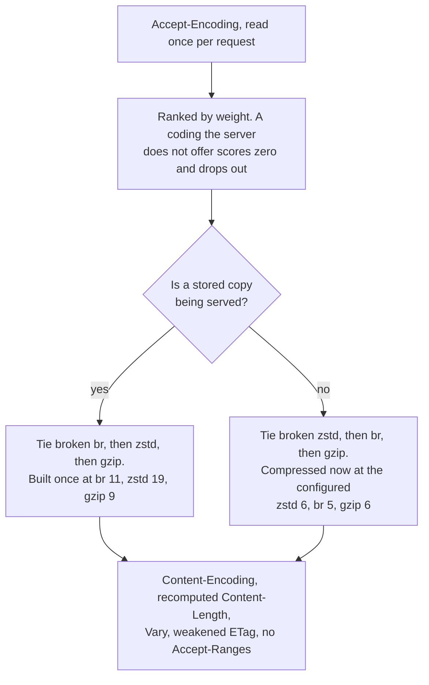
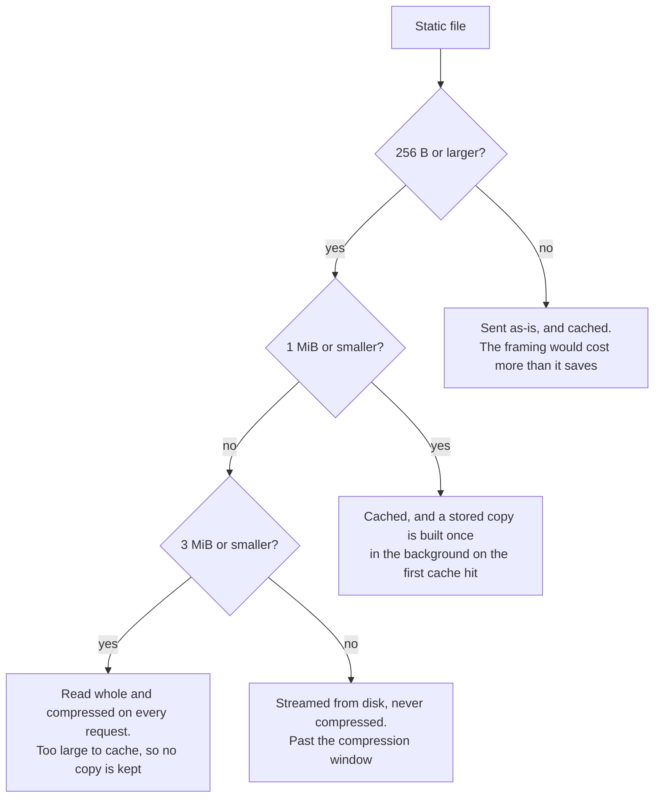

# Compression

OxPHP compresses HTTP responses with Brotli, Zstandard, or gzip, whichever the client accepts. Compression applies automatically to a fixed list of content types — text, JSON, XML, SVG, WebAssembly and several font formats — without any application code changes.

## How It Works

The client's `Accept-Encoding` header is read once, before the request reaches the routing pipeline, and weighed against the codings the server offers. What happens next depends on where the bytes come from.

**A cached static file that already has a stored compressed copy** is answered from that copy directly. Nothing is compressed on the request, and none of the checks below apply. See [Cached static files](#cached-static-files).

**Every other response** — PHP output, a custom error page, a static file with no stored copy yet — goes through the compression step after the response is built:

1. **Partial responses are skipped** — a `206` is never encoded, because its `Content-Range` offsets describe the unencoded representation.
2. **Content type check** — the response MIME type is looked up in the list of compressible types.
3. **Already encoded check** — a response that already carries a `Content-Encoding` header is left alone.
4. **Size check** — only bodies between 256 bytes and 3 MiB (3,145,728 bytes) are compressed, inclusive at both ends. The `Content-Length` header is used when the response carries one; PHP responses usually do not, and are measured on the buffered body instead.
5. **Compression** — the negotiated coding is applied at its configured level. If the compressed output is not smaller than the original, the uncompressed response is sent instead.

Compression happens after PHP execution, after static file serving, and after custom error pages are substituted — so a custom `404` body over 256 bytes is compressed like any other response. The built-in error bodies (`404 Not Found`, `500 Internal Server Error`) are a few dozen bytes and fall under the size floor. The status code is otherwise never consulted.

Small bodies are compressed inline; past a threshold the work moves to a blocking thread so it cannot stall the async runtime. The threshold is 64 KiB, dropping to 4 KiB once the level is steep enough for the cost curve to turn — above quality 4 for Brotli, level 6 for gzip, level 9 for Zstandard. At the shipped defaults Brotli is already in the steep half, so Brotli bodies over 4 KiB are compressed off the async thread.



## Choosing a Coding

`Accept-Encoding` is a ranking, not a list (RFC 9110 §12.5.3), and OxPHP reads it as one:

- Coding names are matched case-insensitively, and unknown codings are ignored.
- `br;q=0` is a refusal, not support. It is not the same as leaving the coding out: an omitted coding can still be picked up by a `*`, an explicitly refused one cannot.
- A `*` covers any coding the header does not name explicitly, at the weight given to it.
- A weight that does not parse is not a refusal: the coding keeps the default weight rather than being dropped over a malformed parameter. That cuts both ways on `q=0` — a qvalue carries at most three decimals, so `q=0.000` refuses the coding and `q=0.0000` is not a valid weight at all and reads as full acceptance. A coding named twice is read at its first weight.
- Among the codings a client accepts **and the server offers**, the one it weighted highest wins. A coding withdrawn by configuration scores zero before the ranking, so a client whose favourite coding the server does not offer falls through to its next choice rather than to an uncompressed response.
- A header that accepts nothing — empty, or `*;q=0` — yields an unencoded response. OxPHP never answers `406` over content coding, and never reads `identity` as a token.

Weights tie in the usual case, since browsers send every coding they support without weights. OxPHP breaks that tie by what becomes of the compressed bytes:

| The response is | Preferred coding | Why |
|---|---|---|
| Served from a stored copy | Brotli, then Zstandard, then gzip | The bytes are compressed once at maximum quality and served from memory from then on, so nothing but size counts — and at the top of its range Brotli is the smallest of the three |
| Everything else | Zstandard, then Brotli, then gzip | The bytes are compressed while the client waits and discarded afterwards, so the cost is paid on every request — and at levels a request can afford, Zstandard measured within a few percent of Brotli on size for well under half the CPU |

The first row applies only once a stored copy exists. The hits before it, and every file too large to cache, take the second row — which is why a static asset is usually answered with Zstandard before it is answered with Brotli.

This is a tie-break, not an override: a client that writes `br;q=0.2, gzip;q=0.9` gets gzip on both paths, and the stored copy built for it is a gzip one.

A client that accepts none of the three receives the response unencoded. In practice gzip is the fallback: every HTTP client of the last twenty years accepts it, while Zstandard needs a browser released in 2024 or later. Browsers also gate the newer codings on the connection rather than on their age alone: `br` and `zstd` are advertised over HTTPS and withheld over plain HTTP, so a site served without TLS is a gzip site whatever its visitors are running.

Because the answer depends on the request header, every response inside the compression window carries `Vary: Accept-Encoding` — compressed or not, static or dynamic. A representation the server would encode for some client varies by that header even when this client is being handed the identity bytes, and a shared cache told otherwise would pass those bytes on to a client that had asked for a coding.

Two things sit outside that rule. A dynamic response the server never holds whole — anything streamed as PHP produces it — carries no `Vary`: that path cannot compress under any header, so the response genuinely does not vary. A *static* file large enough to be streamed is not in that group, and does carry the header: the same file is read whole and compressed for a client that negotiated a coding, so the bytes on the wire depend on the request after all. And a `304` carries neither `Vary` nor `Content-Encoding`: it freshens a representation the client already holds rather than describing a new one.

`Vary` is added as its own header line rather than merged into one the application already sent, so a response that set `Vary: Cookie` goes out with two `Vary` lines. That is legal, and OxPHP reads all of them before appending so `Accept-Encoding` is never duplicated — but an intermediary that reads only the first line will miss it.

## Cached Static Files

A static file that fits the content cache (1 MiB or less) and is compressible — a listed type, at least 256 bytes — is compressed once rather than on every request.

The first request for such a file is a cache miss: it is read from disk, stored, and compressed for that request like anything else. The next request finds it cached, and if there is no stored copy yet for the coding that request negotiated, the server asks for one to be built on a background thread; the request that triggered the build is served the per-request way, as is every request arriving while it runs. Once the copy lands, later requests that negotiate the same coding are answered from it. There is no hit counter: the trigger is the first cache hit with no stored copy for that coding, so a file that has only ever been served to gzip clients gets its Brotli copy on the first Brotli client that hits it.

Stored copies are built at each coding's maximum level — Brotli 11, Zstandard 19, gzip 9 — regardless of the configured per-request levels, which a stored copy never uses. There is no separate setting for them: the only way to stop one being built is to withdraw the coding entirely. Maximum quality typically produces 8–12% fewer bytes than Brotli's own per-request level.

Each coding gets its own stored copy, built on demand: a file only ever served to gzip clients never costs a Brotli compression. All of them share the cached file's validator and are discarded together with the cached bytes — when the entry is evicted to stay inside the 64 MiB cache budget, which the stored copies are charged against, or when [`STATIC_REVALIDATE`](static-files.md) is on and notices the file changed on disk. That setting is off by default, so on a default deployment eviction and restart are the only two ways a stored copy is ever discarded. Bytes that do not compress are marked as such and not retried, and a `304` neither triggers a build nor serves a stored copy.

Because the two preferences above differ, a client that accepts both Brotli and Zstandard usually sees the coding change once per file: the first hits are answered with Zstandard, compressed to serve that request, and hits after the stored copy lands are answered with Brotli. Both are valid representations of the same resource and both carry `Vary`, so nothing breaks — but they also share one weak `ETag`, so a cache holding the Zstandard variant revalidates successfully and keeps it. The switch reaches new clients, not ones that already stored a copy.

### Files too large to cache

Between the cache limit and the top of the compression window — 1 MiB to 3 MiB, where framework bundles, source maps and WebAssembly modules live — a file is read whole and compressed **for every request**, whenever the client negotiated a coding and the type is compressible. It is not cached and never gets a stored copy, so this is the most expensive compression the server does per request. Put a CDN in front of assets in that range, or keep them under the cache limit, and the work is done once.

Reading such a file holds it in memory until the response has been written, so only a bounded number of them are read at a time. A request arriving over that limit is served the file streamed and unencoded rather than waiting for room — the same response it would have received before this path existed. Under sustained load on a large asset, some clients therefore get it compressed and some do not; both answers are correct for the URL, and `Vary: Accept-Encoding` is on them either way.

Outside that case a file above 1 MiB is streamed from disk untouched: an incompressible type, a client that accepts no coding, or anything above 3 MiB.

What a static file costs, by size:



Compression along that path assumes a compressible type and a client that negotiated a coding. Take either condition away and the picture is the one it has always been: cached up to 1 MiB, streamed above it, ranges honoured throughout, and nothing encoded anywhere.

## Configuration

| Variable | Default | Description |
|----------|---------|-------------|
| `COMPRESSION_ENCODINGS` | `br,zstd,gzip` | Which codings the server offers, comma-separated. Accepts `br` (or `brotli`), `zstd` and `gzip`, case-insensitively and with any surrounding whitespace. The order written here is ignored — the server picks per response, see [Choosing a coding](#choosing-a-coding). Set the whole value to `off` (or `none`) to switch compression off entirely; `off` is not a list token, so `br,off` is an error, not a switch |
| `COMPRESSION_BROTLI_LEVEL` | `5` | Brotli quality (0–11) |
| `COMPRESSION_ZSTD_LEVEL` | `6` | Zstandard level (0–19) |
| `COMPRESSION_GZIP_LEVEL` | `6` | Gzip level (0–9) |
| `COMPRESSION_LEVEL` | *(unset)* | Deprecated name for `COMPRESSION_BROTLI_LEVEL`, kept for existing deployments together with the second meaning it carried when Brotli was the only coding: `COMPRESSION_LEVEL=0` switches off all compression. Setting it logs a warning at startup. An explicit `COMPRESSION_BROTLI_LEVEL` overrides a non-zero value — but not `COMPRESSION_LEVEL=0`, which switches everything off whatever else is set |

A coding is offered when it is listed in `COMPRESSION_ENCODINGS` **and** its level is not `0`; either one alone withdraws it. A withdrawn coding is gone from the whole feature: it is never negotiated, never compressed on the request path, and never built as a stored copy.

Values are validated at startup rather than corrected: an unknown coding name, or a level outside its range, or a level that is not a number, aborts startup with an error naming the variable. Nothing is clamped and nothing is silently dropped. An empty assignment (`COMPRESSION_ENCODINGS=`, the shape `${VAR:-}` produces when the host variable is missing) is treated as unset and restores the default — it does **not** mean `off`.

Brotli defaults to 5 rather than 4 because its quality knee — a change of hasher — sits between the two: at 4 it produced *more* bytes than gzip does at its own default on JSON above 4 KB and on real minified assets, and spent more CPU doing it, which leaves no reason to prefer it over gzip at all. At 5 it is the smaller of the two on every body measured, for roughly twice gzip's CPU. Levels 9–11 are better suited for offline or build-time compression than for per-request work; cached static files use them anyway, because that cost is paid once. Gzip level 6 is zlib's own default and close to the point of diminishing returns — level 9 costs roughly twice as much for a percent or two. Zstandard defaults to 6 rather than to its own default of 3: on bodies over a few kilobytes level 6 costs less time than the Brotli quality earlier releases compressed everything with, while producing fewer bytes, so nothing regresses against what those releases sent.

## Compressible Content Types

The list is closed — there is no prefix or wildcard rule, so a type absent from it is never compressed even when it would compress well. Within it the match is forgiving: parameters and surrounding whitespace are dropped and the type itself is compared case-insensitively, so `text/html; charset=utf-8` and `Application/JSON` both match.

**Text types:**
- `text/html`
- `text/css`
- `text/plain`
- `text/xml`
- `text/javascript`

**Application types:**
- `application/javascript`
- `application/json`
- `application/xml`
- `application/xhtml+xml`
- `application/rss+xml`
- `application/atom+xml`
- `application/manifest+json`
- `application/ld+json`
- `application/wasm`

**Other types:**
- `image/svg+xml`
- `font/ttf`
- `font/otf`
- `application/x-font-ttf`
- `application/x-font-opentype`
- `application/vnd.ms-fontobject`

## Not Compressed

Responses are sent without compression when any of the following conditions are met:

- The client accepts none of `br`, `zstd`, and `gzip` in the `Accept-Encoding` header, or accepts them only with a zero weight (`br;q=0, zstd;q=0, gzip;q=0`), or sends no such header at all
- Every coding the client accepts has been withdrawn by `COMPRESSION_ENCODINGS` or by a level of `0`
- The response already has a `Content-Encoding` header (e.g. pre-compressed content produced by the application)
- The response body is smaller than 256 bytes or larger than 3 MiB
- The response is a `206 Partial Content` — range offsets describe the unencoded representation, so a partial body is never encoded
- The content type is not in the list above. `image/png`, `image/jpeg`, `font/woff2` and `application/zip` are excluded because those formats already carry their own compression, and `text/event-stream` because an event stream must reach the client event by event — but so are `text/csv`, `application/pdf`, `image/x-icon` and a response with no `Content-Type` at all, which are simply not on the list
- The server does not hold the body whole — PHP scripts using `oxphp_stream_flush()`, Server-Sent Events, and static files read from disk as they are sent. OxPHP compresses a response in one piece. Brotli, Zstandard and gzip can all encode incrementally, so this is a limit of the server rather than of the codings
- The response came from a plugin that answered before the pipeline ran — a rate-limited `429`, for instance — which returns before the compression step
- The response came from the internal listener (`INTERNAL_ADDR`), which serves `/metrics` and the health endpoints unencoded regardless of what the scraper accepts

## Response Headers

A response the server encodes is rewritten as follows, whether it was compressed for that request or served from a stored copy:

| Header | Value |
|--------|-------|
| `Content-Encoding` | `br`, `zstd`, or `gzip`, whichever was negotiated |
| `Content-Length` | Updated to the compressed body size |
| `Vary` | `Accept-Encoding` is appended, so HTTP caches store separate versions per coding |
| `ETag` | A strong tag is weakened to `W/"…"` — the encoded bytes are a different representation, and a strong tag shared with the identity bytes would let a client resume an encoded download with identity fragments |
| `Accept-Ranges` | Removed. Byte offsets are meaningless against an encoded body |

All codings of one static file share that weak tag, which is derived from the identity size and modification time. `Vary` is what keeps the variants apart; the tag only decides freshness, so a cache revalidating one variant cannot tell the server which of them it holds.

Range handling is switched off before the response is built for anything that *would* be compressed for this client, not just for what was: a compressible static file inside the compression window is answered with a full `200` to a client that sends both `Range` and `Accept-Encoding`, and an unsatisfiable range from such a client gets that `200` rather than a `416`. Clients that accept no coding keep ranges, which is where resumable downloads live.

## Observability

Two counters on the [metrics endpoint](../operations/metrics.md) report what compression actually did:

- `oxphp_compressed_responses_total` — responses sent under a content coding
- `oxphp_compression_bytes_saved_total` — identity size minus compressed size, summed

Both count stored-copy hits as well as per-request compressions, so a ratio against `oxphp_requests_total` answers "is compression reaching my traffic" more reliably than a single `curl -I`.

## Troubleshooting

### Responses are not compressed

Verify that the client sends an `Accept-Encoding` header at all — browsers do, but some HTTP testing tools send none by default, and a request without one gets an unencoded response.

A weight of zero is a refusal, not a preference: `Accept-Encoding: br;q=0, zstd;q=0, gzip;q=0` disables compression for that request as surely as sending no header.

**Check** with curl:

```bash
curl -H "Accept-Encoding: br, zstd, gzip" -I http://localhost/
```

Look for `Content-Encoding` in the response headers. If it is absent, check that:

1. `COMPRESSION_ENCODINGS` still lists the coding you asked for, and its level is not `0`
2. The response body is at least 256 bytes and no larger than 3 MiB
3. The response `Content-Type` is on the compressible list above. Case and parameters make no difference; being absent from the list does
4. The handler does not stream. A script that calls `oxphp_stream_flush()`, sends Server-Sent Events, or otherwise starts writing before the length is known is passed through untouched, and this is the most common cause in an application that flushes

### Different clients get different codings

This is the point of negotiation, and three cases account for nearly all of it. Browsers withhold `br` and `zstd` over plain HTTP: there they send `Accept-Encoding: gzip, deflate` and are answered with gzip, however recent they are. Command-line tools often send no `Accept-Encoding` at all and are answered unencoded. And over HTTPS a browser new enough to send `zstd` gets Zstandard on a dynamic response where an older one gets Brotli. Nothing is misconfigured in any of these, and the responses that are compressed carry `Vary: Accept-Encoding` so caches keep them apart.

### The coding changes for the same static file

Expected: the first hits on a cacheable static file are compressed with Zstandard to answer that request, and once the stored Brotli copy is built in the background, later hits are answered from it. See [Cached static files](#cached-static-files).

### A range request returns the whole file

Expected for a compressible file inside the compression window when the client also sends `Accept-Encoding`: the representation it is being served is encoded, and identity byte offsets do not describe it. The same request without `Accept-Encoding` gets its `206`. See [Response headers](#response-headers).

### Compression is making responses larger

A body that does not compress — a base64 blob, a payload of random identifiers, an already-compressed image wrapped as `image/svg+xml` — can come back from any of the three codings no smaller than it went in. OxPHP compares the two and sends the original whenever compression did not help, so this needs no configuration. It cannot be a small-response problem: 256 bytes is the floor for attempting compression at all.

### Throughput fell when compression was turned on

Compression is not a one-way gain. Which way it goes depends on what the server was short of before it was switched on, and the same setting on the same server can move throughput several times in either direction.

Against a saturated link it is the largest win available: a text response that shrinks eightfold is delivered eightfold faster, and the CPU it spends was idle waiting on the wire.

Against a narrow async runtime it is a cost. A body under the hand-off threshold is compressed on an async worker thread, and the runtime sizes itself at half the machine's threads by default — so that work is taken out of the pool carrying every open connection, while the rest of the machine may have capacity to spare. It does not take much to fill: two runtime threads compressing 1.5 KB JSON bodies are saturated by that work alone. The reading that identifies it: throughput falls while the machine and the PHP worker pool both get *less* busy, because neither of them is what ran out.

**What to check:** whether the runtime is narrower than the machine. `TOKIO_WORKERS` defaults to half the available cores, and raising it lets this work use more of the machine — how much more depends on the machine and on what else is running, so measure rather than assume. Measure the worker pool as you do: its threads are separate from the runtime's, so on a deployment already CPU-bound in PHP, a wider runtime takes cycles from the application rather than finding new ones.

Sending small bodies to the blocking pool instead is not the fix it appears to be. On a two-thread runtime, a 1.5 KB JSON body compressed inline occupies about 7 µs of a runtime thread; handed to the blocking pool and collected back, it occupies 13–19 µs of one — submitting the work, parking and waking are themselves runtime work, and they cost more of it than the compression they were meant to move. Throughput on that runtime falls to between a third and a half, and the wait of everything else on the runtime goes up rather than down. That is what the size thresholds are drawn for.

### High CPU usage from compression

Compression cost climbs steeply at the top of every coding's range — Brotli 8–11, gzip 8–9, Zstandard 12–19 — and the per-request defaults sit well below that. If you observe high CPU consumption from compression:

**Fix:** lower `COMPRESSION_ZSTD_LEVEL` to `3` and `COMPRESSION_GZIP_LEVEL` to `4`. Brotli is the expensive coding of the three, but lowering `COMPRESSION_BROTLI_LEVEL` to `4` is not the way to save that CPU — at 4 it produces more bytes than gzip does at its own default while still costing more than gzip. Drop `br` from `COMPRESSION_ENCODINGS` instead. Note where that lands each client: anything modern enough to send `zstd` falls through to Zstandard, not gzip, so the change costs it nothing; only clients that accept Brotli *without* Zstandard — Safari, browsers predating 2024, most intermediaries — move to gzip, which on real bodies is 2–6% larger for roughly half the CPU.

Cached static files are not part of this cost: their compressed copies are built once in the background whichever codings remain. Files between 1 MiB and 3 MiB are, though — they are compressed on every request and cannot be cached; see [Files too large to cache](#files-too-large-to-cache).

### Pre-compressed assets are being compressed again

OxPHP does not look for `.br`, `.zst` or `.gz` files next to the original — a request for `/app.js` is never answered from `/app.js.br`, and requesting the compressed file directly serves it as an opaque download that browsers will not decode. Build-time compression of static assets has no place to plug in; the server's own [stored copies](#cached-static-files) fill that role, at the same maximum quality, without the build step.

Skipping re-compression applies to responses that already carry a `Content-Encoding` header, which in practice means a PHP script that encoded its own body and set the header itself.

## Docker Example

```yaml
services:
  app:
    image: ghcr.io/oxphp/oxphp:0.11.0
    ports:
      - "8080:80"
    volumes:
      - ./src:/var/www/html
    environment:
      - DOCUMENT_ROOT=/var/www/html/public
      - ENTRY_FILE=index.php
      - COMPRESSION_ENCODINGS=br,zstd,gzip
      - COMPRESSION_BROTLI_LEVEL=5
      - COMPRESSION_ZSTD_LEVEL=6
      - COMPRESSION_GZIP_LEVEL=6
```

## See Also

- [Static Files](static-files.md) — file serving, MIME detection, and HTTP caching
- [Metrics](../operations/metrics.md) — the compression counters and the rest of the endpoint
- [Configuration Reference](../operations/configuration.md) — full list of environment variables
